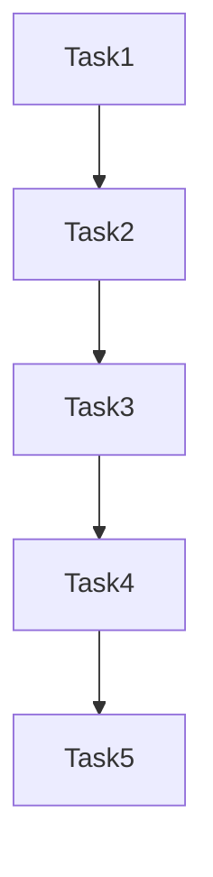

# Task Breakdown

## Task List
- [ ] Task 1: [Description] (Est: Xh)
- [ ] Task 2: [Description] (Est: Xh)
- [ ] Task 3: [Description] (Est: Xh)
- [ ] Task 4: [Description] (Est: Xh)
- [ ] Task 5: [Description] (Est: Xh)

## Task Dependencies

## Assigned To
- Task 1: [Developer]
- Task 2: [Developer]
- Task 3: [Developer]

## Notes
[Any additional notes or considerations]
