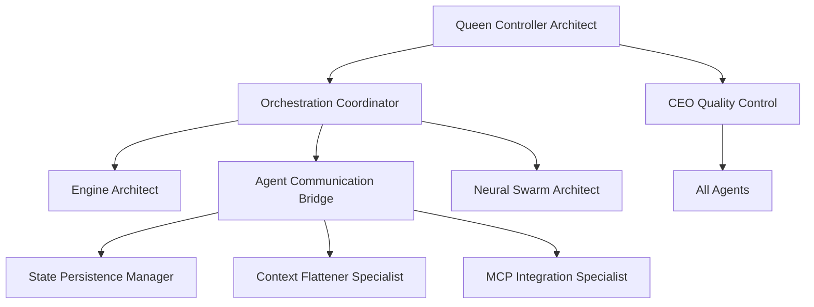

# Inter-Agent Communication Matrix

## Queen Controller Hierarchy



## Communication Protocols

### Primary Communication Channels

| Source Agent | Target Agent | Protocol | Data Type | Frequency |
|--------------|--------------|----------|-----------|-----------|
| Queen Controller | All Agents | Command/Control | Instructions, Status | Real-time |
| CEO Quality Control | All Agents | Audit/Approval | Quality Checks | On-demand |
| Orchestration Coordinator | Worker Agents | Task Assignment | Tasks, Resources | Continuous |
| Agent Communication Bridge | All Agents | Message Routing | All Types | Real-time |
| Neural Swarm Architect | Agent Clusters | Swarm Control | Collective Tasks | Dynamic |

### Specialized Communication Flows

#### 1. Development Workflow
```
SPARC Methodology → Engine Architect → Test Automation → Documentation Generator
                 ↓                   ↓                ↓
         Config Management → Deployment Pipeline → Metrics Monitoring
```

#### 2. Error Recovery Flow
```
Error Detection (Any Agent) → Error Recovery Specialist
                           ↓
                    State Persistence Manager
                           ↓
                    Queen Controller (Notification)
                           ↓
                    CEO Quality Control (Validation)
```

#### 3. Resource Management Flow
```
Resource Scheduler ← → Metrics Monitoring Engineer
        ↓                      ↓
Intelligence Analyzer → Queen Controller
        ↓
Optimization Decisions → All Agents
```

## Shared Memory Access Matrix

### Write Permissions

| Agent | Shared Memory Sections |
|-------|------------------------|
| Queen Controller | All sections |
| State Persistence Manager | State, Checkpoints, Recovery |
| Context Flattener | Context, Compression Maps |
| Intelligence Analyzer | Metrics, Analytics, Predictions |
| Config Management | Configuration, Secrets |
| Error Recovery | Error Logs, Recovery State |

### Read Permissions

All agents have READ access to:
- Global configuration
- System metrics
- Agent status
- Shared context
- Error logs

## Event-Driven Communication

### Critical Events

| Event | Publisher | Subscribers | Action |
|-------|-----------|-------------|--------|
| `system.emergency` | Error Recovery | Queen, CEO, All Agents | Immediate Response |
| `deployment.started` | Deployment Pipeline | Monitoring, Testing | Prepare Validation |
| `security.breach` | Security Auditor | Queen, CEO, Error Recovery | Lockdown |
| `resource.exhausted` | Resource Scheduler | Queen, Intelligence | Scale/Optimize |
| `task.completed` | Any Worker | Orchestration, State | Update Progress |

### Performance Events

| Event | Frequency | Subscribers | Purpose |
|-------|-----------|-------------|---------|
| `metrics.update` | 5s | Intelligence, Monitoring | Real-time Analytics |
| `health.check` | 30s | Queen, Error Recovery | System Health |
| `sync.state` | 100ms | State Manager, Context | Consistency |
| `context.compress` | On-demand | Context Flattener | Optimization |

## Agent Dependency Graph

### Critical Dependencies

```yaml
queen_controller:
  depends_on: []
  required_by: [all]

ceo_quality_control:
  depends_on: [queen_controller]
  required_by: [all_deployments]

orchestration_coordinator:
  depends_on: [queen_controller]
  required_by: [all_workers]

state_persistence_manager:
  depends_on: [queen_controller]
  required_by: [error_recovery, context_flattener]

error_recovery_specialist:
  depends_on: [state_persistence_manager, metrics_monitoring]
  required_by: [all_critical_operations]
```

### Service Dependencies

```yaml
engine_architect:
  requires: [mcp_integration, config_management]
  provides: [system_design, architecture]

test_automation_engineer:
  requires: [engine_architect, deployment_pipeline]
  provides: [validation, quality_assurance]

deployment_pipeline_engineer:
  requires: [test_automation, security_auditor]
  provides: [continuous_deployment]

documentation_generator:
  requires: [all_agents_output]
  provides: [documentation, knowledge_base]
```

## Communication Patterns

### 1. Request-Response Pattern
- **Used by**: CEO Quality Control, Queen Controller
- **Timeout**: 5 seconds
- **Retry**: 3 attempts with exponential backoff

### 2. Publish-Subscribe Pattern
- **Used by**: Metrics Monitoring, Intelligence Analyzer
- **Topics**: System events, metrics, alerts
- **Delivery**: At-least-once guarantee

### 3. Stream Processing Pattern
- **Used by**: Context Flattener, Neural Swarm
- **Buffer**: 10MB per stream
- **Processing**: Sliding window with 5-minute retention

### 4. Broadcast Pattern
- **Used by**: Queen Controller, CEO Quality Control
- **Scope**: All agents or specific groups
- **Confirmation**: Required for critical broadcasts

## Performance SLAs

### Communication Latency

| Channel Type | P50 | P95 | P99 | Max |
|-------------|-----|-----|-----|-----|
| Direct Message | 1ms | 5ms | 10ms | 50ms |
| Broadcast | 5ms | 20ms | 50ms | 100ms |
| Shared Memory | <1ms | 2ms | 5ms | 10ms |
| Event Bus | 2ms | 10ms | 25ms | 50ms |

### Throughput Targets

| Channel | Messages/sec | Data/sec |
|---------|-------------|----------|
| Queen Controller | 10,000 | 100MB |
| Agent Bridge | 50,000 | 500MB |
| Shared Memory | 100,000 | 1GB |
| Event Bus | 25,000 | 250MB |

## Failure Handling

### Communication Failures

1. **Primary Channel Failure**
   - Automatic failover to backup channel
   - State preservation in shared memory
   - Recovery coordination via Queen Controller

2. **Agent Unresponsive**
   - 3 heartbeat misses trigger investigation
   - Error Recovery Specialist intervention
   - Potential agent restart or replacement

3. **Network Partition**
   - Split-brain prevention via Queen arbitration
   - Eventual consistency via State Persistence
   - Automatic reconciliation on reunion

## Security Protocols

### Authentication
- All agents use signed JWT tokens
- Token rotation every 1 hour
- Mutual TLS for critical communications

### Authorization
- Role-based access control (RBAC)
- Capability-based security for operations
- Audit logging for all privileged actions

### Encryption
- AES-256 for data at rest
- TLS 1.3 for data in transit
- End-to-end encryption for sensitive operations

## Monitoring & Observability

### Communication Metrics
- Message rate per channel
- Latency percentiles
- Error rates and types
- Queue depths and backlogs

### Health Indicators
- Agent responsiveness
- Channel utilization
- Memory usage per agent
- Network bandwidth consumption

### Alerting Thresholds
- Latency > 100ms (P99)
- Error rate > 1%
- Queue depth > 1000 messages
- Agent unresponsive > 30 seconds