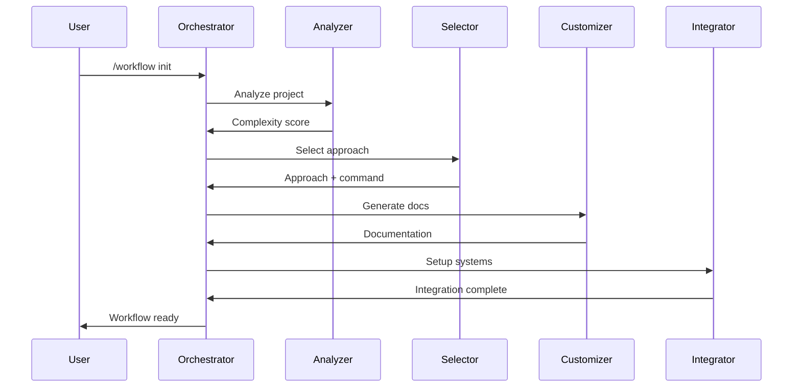
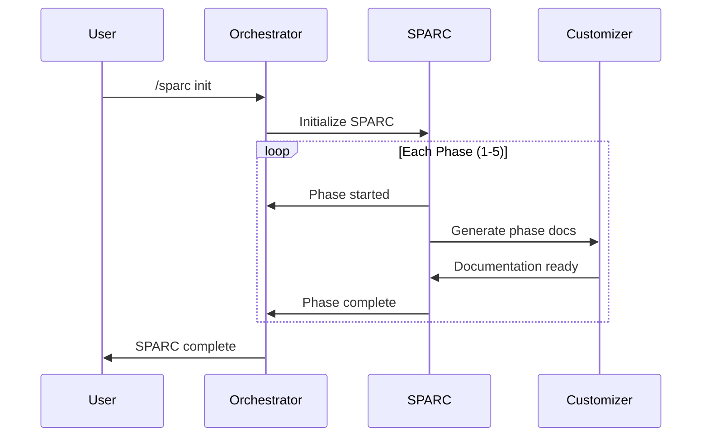

# 🤖 Agent Architecture & Orchestration

## Overview

The Intelligent Workflow Decision System uses a sophisticated multi-agent architecture with 6 specialized agents that work together to analyze, plan, and execute development workflows across any project type or technology stack.

## Agent Roster

### 1. 🟣 Workflow Orchestrator
**Role**: Master Coordinator  
**Model**: Opus  
**Responsibilities**:
- Overall workflow coordination
- Agent task assignment and routing
- State management across sessions
- Error recovery and fallback handling
- Claude Flow version management

### 2. 🔵 Complexity Analyzer Agent
**Role**: Project Analysis Specialist  
**Model**: Default  
**Responsibilities**:
- 8-dimensional project analysis
- Complexity scoring (0-100)
- Project stage detection (idea/early/active/mature)
- Technology stack detection
- Architecture pattern recognition

### 3. 🟢 Approach Selector Agent
**Role**: Strategy Selection Expert  
**Model**: Default  
**Responsibilities**:
- Maps complexity to optimal approach
- Generates precise Claude Flow commands
- Manages user preferences and overrides
- Calculates confidence scores
- Detects approach mismatches

### 4. 🟡 Document Customizer Agent
**Role**: Documentation Generator  
**Model**: Default  
**Responsibilities**:
- Generates tech-stack specific CLAUDE.md
- Creates Agent-OS instructions
- Produces workflow configurations
- Generates SPARC phase documentation
- Creates agent configurations

### 5. 🔴 SPARC Methodology Agent
**Role**: Enterprise Methodology Manager  
**Model**: Opus  
**Responsibilities**:
- Manages 5-phase SPARC process
- Enforces quality gates
- Validates phase transitions
- Tracks deliverables
- Manages enterprise documentation

### 6. 🔷 Integration Coordinator Agent
**Role**: System Integration Specialist  
**Model**: Default  
**Responsibilities**:
- Claude Code settings management
- Agent-OS integration
- TMux orchestration
- MCP server connections
- Health monitoring

## Communication Protocol

### Message Format
```yaml
id: uuid
timestamp: iso8601
from: agent_name
to: agent_name|broadcast
type: request|response|notification|error
priority: low|medium|high|critical
payload: object
correlation_id: uuid (for responses)
ttl: seconds
```

### Communication Channels

#### Analysis Channel
- **Publisher**: complexity-analyzer-agent
- **Subscribers**: workflow-orchestrator, approach-selector-agent
- **Purpose**: Share project analysis results

#### Selection Channel
- **Publisher**: approach-selector-agent
- **Subscribers**: workflow-orchestrator, document-customizer-agent
- **Purpose**: Communicate approach decisions

#### Documentation Channel
- **Publisher**: document-customizer-agent
- **Subscribers**: workflow-orchestrator, integration-coordinator-agent
- **Purpose**: Share generated documentation

#### SPARC Channel
- **Publisher**: sparc-methodology-agent
- **Subscribers**: workflow-orchestrator, document-customizer-agent
- **Purpose**: SPARC phase management

#### Integration Channel
- **Publisher**: integration-coordinator-agent
- **Subscribers**: workflow-orchestrator
- **Purpose**: System integration status

## Agent Activation Patterns

### By Complexity Score

#### Simple Projects (0-30)
```
Agents: [workflow-orchestrator]
Approach: Simple Swarm
Command: npx claude-flow@alpha swarm
```

#### Medium Projects (31-70)
```
Agents: [
  workflow-orchestrator,
  complexity-analyzer-agent,
  approach-selector-agent,
  document-customizer-agent,
  integration-coordinator-agent
]
Approach: Hive-Mind
Command: npx claude-flow@alpha hive-mind spawn
```

#### Complex Projects (71-100)
```
Agents: [
  workflow-orchestrator,
  sparc-methodology-agent,
  complexity-analyzer-agent,
  approach-selector-agent,
  document-customizer-agent,
  integration-coordinator-agent
]
Approach: Hive-Mind + SPARC
Command: npx claude-flow@2.0 hive-mind spawn --sparc
```

## Workflow Execution Sequences

### New Project Initialization


### SPARC Enterprise Flow


## Slash Commands

### Core Commands

#### `/workflow`
- **Purpose**: Main workflow control
- **Options**: init, analyze, status, help
- **Modes**: --auto, --interactive, --swarm, --hive, --sparc
- **Example**: `/workflow init --auto "Build REST API"`

#### `/analyze`
- **Purpose**: Quick complexity analysis
- **Options**: [path], --detailed
- **Output**: Score, stage, recommendations
- **Example**: `/analyze /path/to/project --detailed`

#### `/sparc`
- **Purpose**: SPARC methodology management
- **Options**: init, phase [1-5], status, validate
- **Example**: `/sparc phase 1`

#### `/agents`
- **Purpose**: Agent management
- **Options**: list, status, activate, test
- **Example**: `/agents status`

#### `/quick`
- **Purpose**: Rapid workflow execution
- **Automatic**: Analysis, selection, execution
- **Example**: `/quick "Fix authentication bug"`

## Installation & Setup

### Per-Project Installation
```bash
# From any project directory
/path/to/MASTER-WORKFLOW/install-standalone.sh

# Creates:
.ai-workflow/           # Local installation
├── intelligence-engine/
├── agent-templates/
├── slash-commands/
├── configs/
└── bin/

.claude/
├── agents/            # Agent configurations
└── commands/          # Slash commands

.agent-os/
├── specs/
├── plans/
└── tasks/

.claude-flow/
└── sparc-phases/
```

### Agent Registration
During installation, agents are:
1. Copied from templates
2. Customized for project
3. Registered with Claude Code
4. Connected via orchestration config

## Orchestration Configuration

### orchestration.json
- Master agent designation
- Agent roles and responsibilities
- Communication channels
- Error handling strategies

### agent-mappings.json
- Complexity to agent mapping
- Task to agent routing
- Activation triggers
- Execution sequences

### communication-protocol.json
- Message formats
- QoS guarantees
- Routing rules
- Event definitions

## Integration Points

### Claude Flow 2.0
All versions supported:
- @alpha (default)
- @beta
- @latest
- @2.0
- @stable
- @dev

### Agent-OS
- Specification generation
- Planning integration
- Task execution
- Progress tracking

### TMux Orchestrator
- Session management
- Long-running processes
- 24/7 operation
- Process monitoring

### MCP Servers
- filesystem
- memory
- github
- brave-search
- sequential-thinking
- And 20+ more

## Quality Assurance

### Agent Health Monitoring
- Status checks every 30s
- Resource usage tracking
- Error rate monitoring
- Automatic recovery

### Communication Validation
- Message schema validation
- Timeout handling
- Retry with backoff
- Dead letter queue

### Performance Metrics
- Agent response time < 100ms
- Message routing < 50ms
- State sync < 1s
- Recovery time < 30s

## Best Practices

### For Agent Development
1. Single responsibility per agent
2. Clear communication contracts
3. Graceful error handling
4. State preservation
5. Idempotent operations

### For Workflow Design
1. Start simple, scale up
2. Use appropriate complexity
3. Monitor resource usage
4. Document decisions
5. Test agent interactions

### For Production Use
1. Enable health monitoring
2. Set resource limits
3. Configure logging
4. Implement circuit breakers
5. Regular backup of state

## Troubleshooting

### Common Issues

#### Agent Not Responding
```bash
# Check agent status
./ai-workflow agents status

# Restart specific agent
./ai-workflow agents restart [name]
```

#### Communication Failure
```bash
# Check message queue
cat .ai-workflow/logs/messages.log

# Clear dead letters
rm .ai-workflow/queue/dead-letter/*
```

#### Wrong Approach Selected
```bash
# Override with manual selection
./ai-workflow init --sparc

# Adjust complexity scoring
edit .ai-dev/analysis.json
```

## Future Enhancements

### Planned Features
- [ ] Agent learning from outcomes
- [ ] Dynamic agent spawning
- [ ] Cross-project agent sharing
- [ ] Agent marketplace
- [ ] Visual orchestration designer

### Research Areas
- Neural agent coordination
- Predictive approach selection
- Automated agent generation
- Self-healing workflows
- Distributed agent execution

## Summary

The agent architecture provides:
- **Intelligent Analysis**: Deep project understanding
- **Optimal Selection**: Right approach every time
- **Seamless Coordination**: Agents work in harmony
- **Enterprise Ready**: SPARC for complex projects
- **Full Automation**: Minimal human intervention

This creates a truly autonomous, intelligent workflow system that adapts to any project, technology stack, or complexity level.