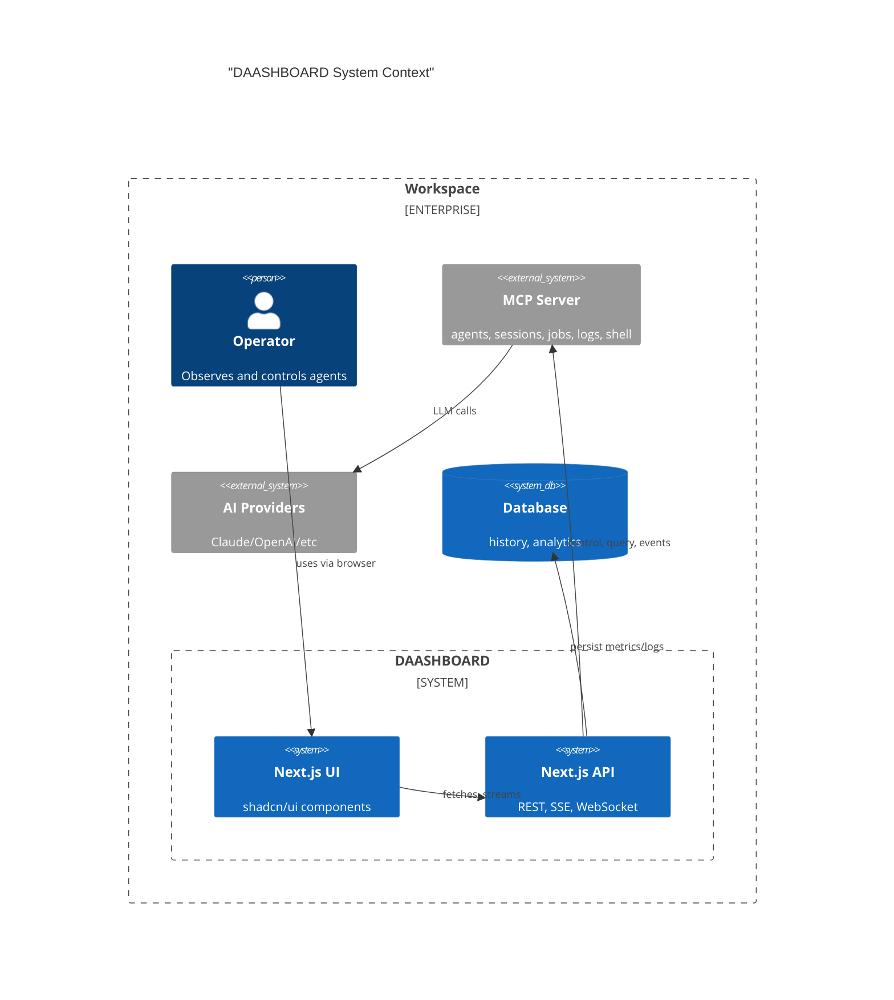
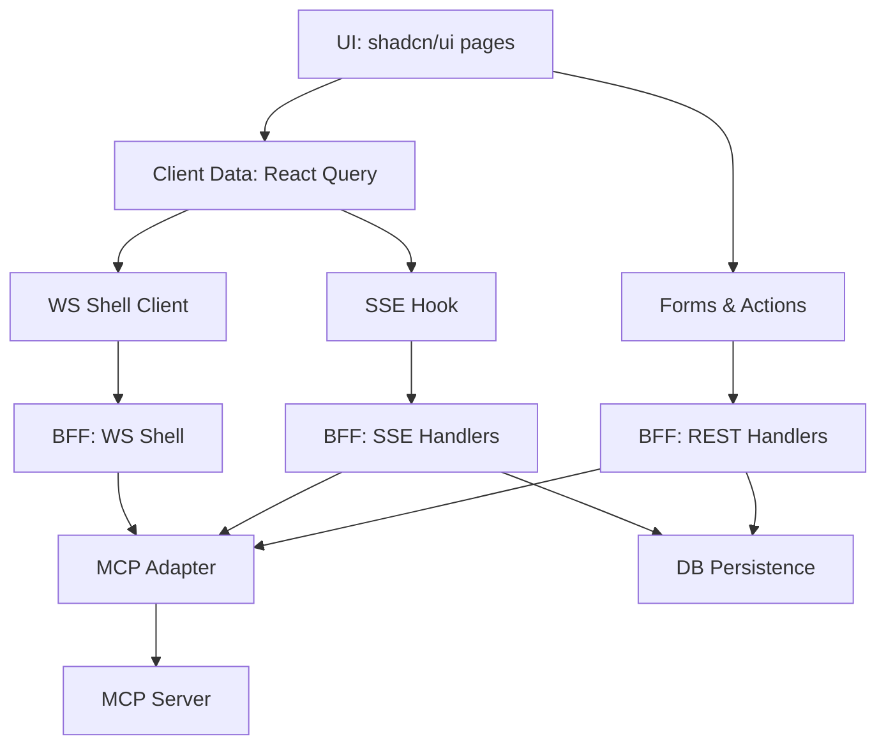
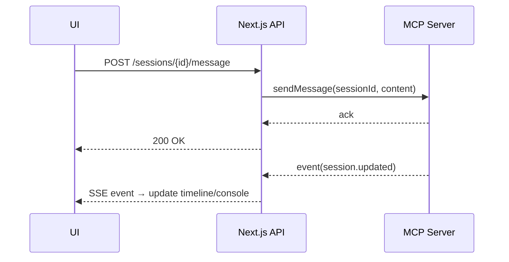
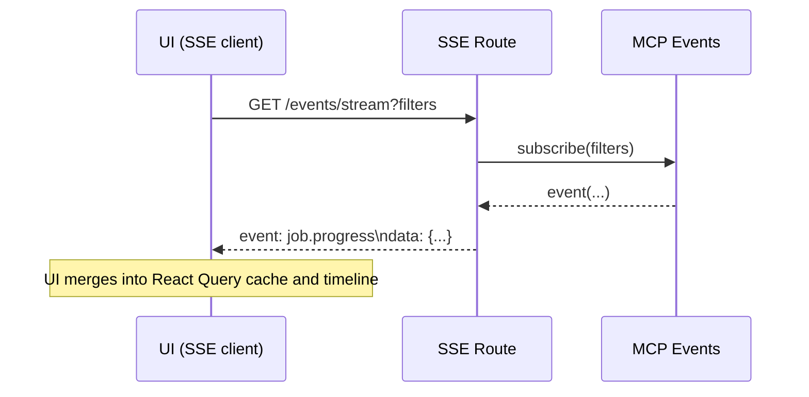
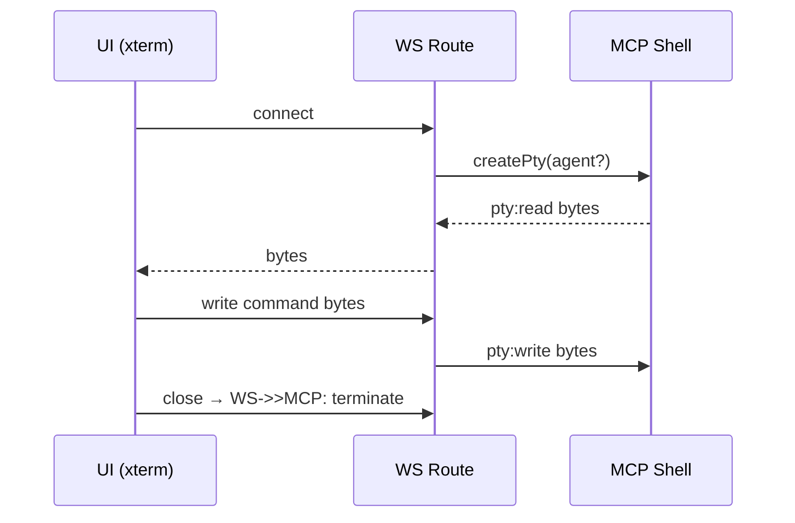

# Architecture

A lightweight operations dashboard built on Next.js App Router and shadcn/ui, backed by a thin BFF (route handlers) that proxy to the MCP server for agent control, events, jobs, and shell. Real-time updates via SSE; interactive shell via WebSocket.

- UI: shadcn/ui components for consistent UX and accessibility
- BFF: Next.js API route handlers (REST + SSE + WS)
- Event Bus: in-process broker with adapters to MCP event streams
- MCP Server: single source of truth for agents, sessions, jobs, logs, shell
- Storage: durable DB (SQLite/Postgres) for history and analytics
- AuthZ: simple RBAC (viewer/operator/admin)

Reference components: https://ui.shadcn.com/

## System Context

## Component Breakdown

## Key Flows

### Chat/Message Flow

### Event Stream (SSE)

### Shell (WebSocket)

## Reliability & Security

- Reconnect strategy on SSE with backoff; idempotent UI updates
- WS heartbeat/ping for shell; auto-close on idle
- RBAC on API routes; CSRF on POST; secrets server-only
- Structured logs; metrics for tokens/cost/latency

## Deployment Notes

- Single Next.js app; colocated API handlers
- MCP endpoint URL via env; DB URL via env
- Edge-friendly SSE; Node runtime for WS
