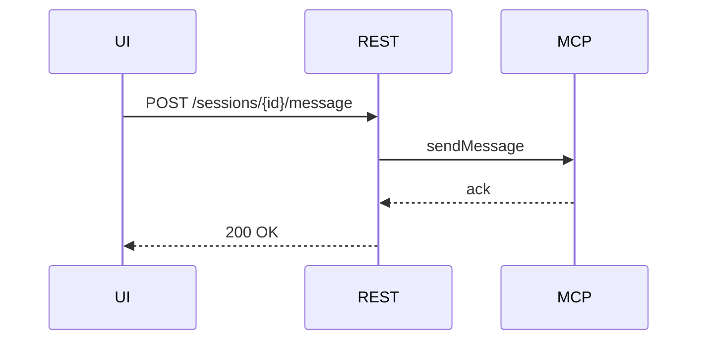
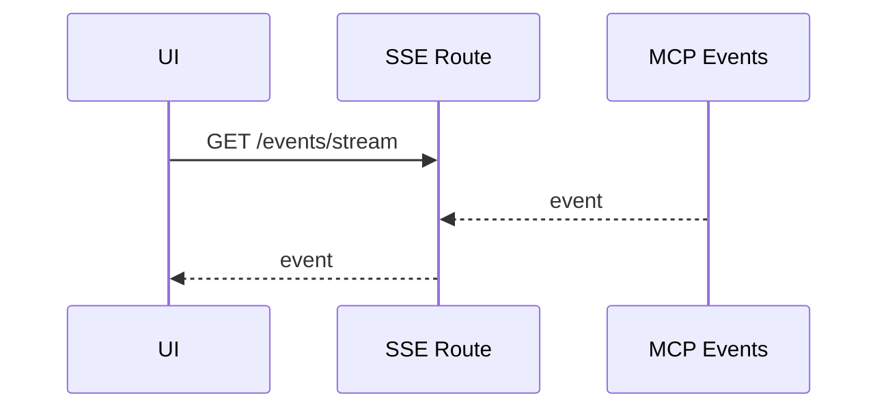
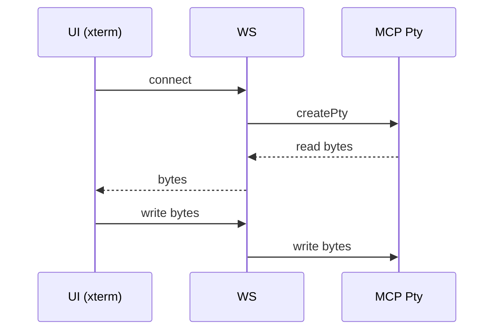

# Diagrams

## Architecture (System Context)

```mermaid
graph LR
  user([Operator]) --> ui[Next.js UI]\n
  ui --> api[Next.js API]\n  api --> mcp[MCP Server]\n  mcp --> providers[AI Providers]\n  api --> db[(DB)]
```

## Component View

```mermaid
graph TD
  subgraph UI
    P[Pages & Layout]\n    C[Components (shadcn/ui)]\n    RQ[React Query]\n    SSE[SSE Hook]\n    WS[WS Client]
  end
  subgraph Server
    REST[REST Routes]\n    SSEH[SSE Route]\n    WSH[WS Shell]\n    ADPT[MCP Adapter]\n    PERS[Persistence]
  end
  P --> C
  C --> RQ
  RQ --> REST
  SSE --> SSEH
  WS --> WSH
  REST --> ADPT
  SSEH --> ADPT
  WSH --> ADPT
  ADPT --> MCP[MCP Server]
  REST --> PERS
  SSEH --> PERS
```

## Chat Sequence



## SSE Stream



## Shell WS



## Sitemap

```mermaid
graph TD
  root[/daashboard/] --> agents[/agents/]
  root --> sessions[/sessions/]
  root --> jobs[/jobs/]
  root --> console[/console/]
  root --> logs[/logs/]
  root --> analytics[/analytics/]
  root --> settings[/settings/]
  agents --> agentId[/agents/[agentId]/]
  sessions --> sessionId[/sessions/[sessionId]/]
```
