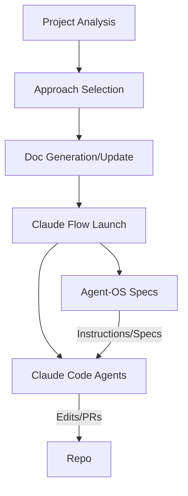

# Integrations: Claude Code + Claude Flow 2.0 + Agent-OS

## High-level: How they work together

- Claude Code: Interactive coding agents and slash commands in `.claude/`; local developer experience, code edits, recovery specialists, hooks.
- Claude Flow 2.0: Multi-agent runtime (Swarm, Hive-Mind, SPARC) orchestrated via `npx claude-flow@<version>`; roles, persistence, sessions.
- Agent-OS: Product/spec system under `.agent-os/` (instructions, specs) providing source-of-truth requirements.

The workflow system bridges all three by:
- Analyzing the project and selecting the optimal approach.
- Generating/upgrading docs both systems consume (CLAUDE.md, Agent-OS, hive-config).
- Launching Claude Flow with `--claude` so Claude Code participates in orchestration.

## Typical orchestration flow

## Roles & responsibilities

- Claude Code
  - Development agents: refactor, tests, fixes, recovery
  - Slash commands: `/workflow`, `/agents`, `/quick`, `/sparc`

- Claude Flow 2.0
  - Swarm (single-agent), Hive-Mind (multi-agent), SPARC (enterprise phases)
  - Session persistence, memory, artifacts

- Agent-OS
  - Structured product/feature specs
  - Instructions to enforce conventions and quality

## Data and context surfaces

- `.ai-dev/analysis.json`: complexity, stage, stack
- `.ai-workflow/configs/approach.json`: selected approach and commands
- `.claude-flow/hive-config.json`: roles, prompts, routing, version
- `.claude/CLAUDE.md` and `.agent-os/instructions/*`: shared context and standards

## Versioning and compatibility

- Set `CLAUDE_FLOW_VERSION` to `alpha|beta|latest|stable|2.0|dev`
- Runner normalizes and applies `npx claude-flow@<version>` consistently
- YOLO flags gated; blocked in CI; explicit acknowledgements required

## Failure handling

- Claude Flow missing → system still analyzes and prepares commands for later
- Claude Code missing → `--claude` omitted; Flow can still run
- Agent-OS missing → docs scaffolding created; intelligent updater merges when present

## Practical tips

- Keep `.claude/CLAUDE.md` and `.agent-os/instructions/*` current for best agent output
- Use the status dashboard (SSE) to observe approach changes and agent activity
- Prefer `CLAUDE_FLOW_VERSION=stable` for long-running production efforts
