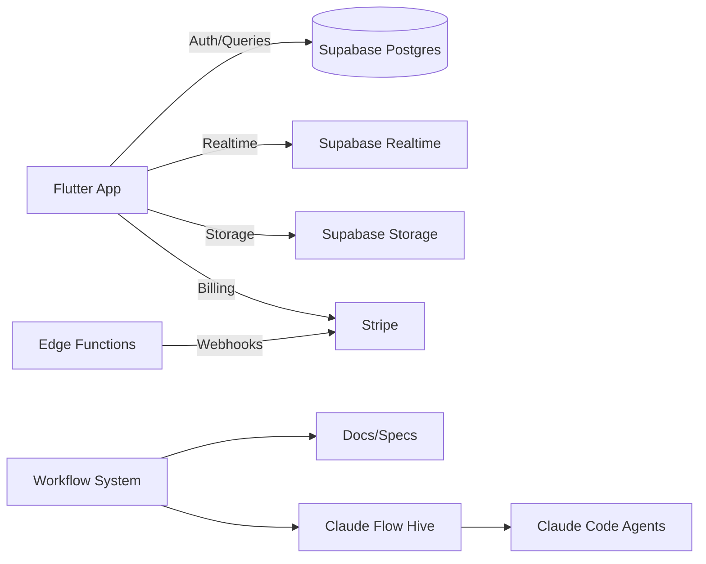
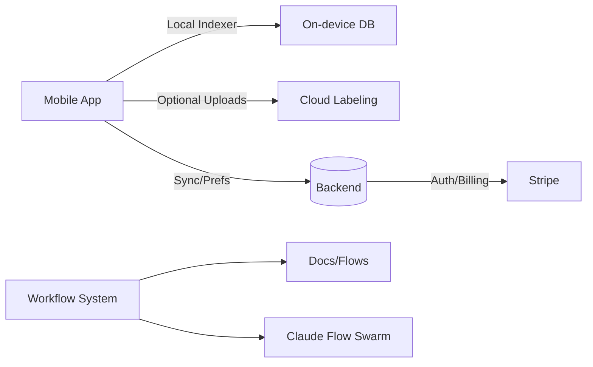

# Use Cases and Examples

## 1) Refactor a single-user Flutter recipe gamification app into SaaS (Supabase backend)

Goals
- Keep Flutter UI/UX; add multi-tenant backend with Supabase
- Scale for millions: auth, RLS, realtime, billing, observability

Architecture (high-level)


Steps with the workflow system
1. Analyze current repo
   - `./ai-workflow analyze`
   - Review `.ai-dev/analysis.json` recommendations
2. Select approach and scaffold backend
   - Medium complexity → Hive-Mind: `./ai-workflow init --hive "SaaS refactor plan"`
   - Generate Agent-OS specs for multi-tenancy, RLS, auth flows, migrations
3. Implement Supabase
   - Define schemas (users, teams, recipes, gamification) with tenant IDs
   - RLS policies for tenant isolation; service role for admin operations
   - Edge Functions for webhooks (Stripe events → update entitlements)
4. Integrate Flutter
   - Swap local storage to Supabase client; add auth/state management
   - Realtime channels for gamification events
5. CI/CD and Observability
   - GitHub Actions; migration checks; health probes
   - Logging/Sentry; Supabase monitoring

Command snippets
```bash
./ai-workflow init --hive "Design multi-tenant schema, RLS, migration plan"
./ai-workflow prompt           # refine requirements
./ai-workflow status-dashboard # monitor multi-agent execution
```

## 2) Elderly safety mobile SaaS: inactivity + fall detection, emergency contacts, caregiver companion app

Key features
- Inactivity timer (configurable), fall detection with sensitivity controls
- Emergency contacts, SMS with GPS link, one-tap call back or 911, local non-emergency numbers
- Caregiver app/portal: view location, manage settings remotely, toggle safety modes

Architecture
```mermaid
flowchart LR
  A[Mobile App] -- Background Services --> B[Local Sensors]
  A -- Location --> C[GPS]
  A -- API --> D[(Backend: Supabase/Firebase)]
  D -- Functions --> E[Notifications/SMS (Twilio)]
  D -- Realtime --> F[Caregiver Portal]
  G[Workflow System] --> H[Specs/Docs]
  G --> I[Claude Flow SPARC]
```

Workflow system plan
1. Analyze and pick approach
   - High complexity → SPARC: `CLAUDE_FLOW_VERSION=stable ./ai-workflow init --sparc`
2. Generate specs
   - Agent-OS specs for privacy/consent, data retention, HIPAA-adjacent considerations, alerting flows
   - Mobile background execution guides per OS
3. Build backend
   - Tables: users, profiles, devices, events, alerts, contacts
   - Functions: inactivity detection, fall event processing, SMS dispatch
   - Secure APIs + RLS/claims
4. Build apps
   - Mobile app: timers, motion sensors, location, accessibility
   - Caregiver portal: dashboards, remote settings, audit logs
5. Safety and reliability
   - Offline-first buffers; retry queues; escalation policies; test plans

Commands
```bash
./ai-workflow analyze
CLAUDE_FLOW_VERSION=stable ./ai-workflow init --sparc
./ai-workflow prompt
```

## 3) Camera roll cleanup SaaS with Tinder-style swipe

Goals
- Simple mobile UX to keep/archive/delete photos with fast swipe gestures
- Optional cloud labeling; privacy-first local modes

Architecture


Workflow system plan
1. Analyze and pick approach
   - Low complexity → Swarm: `./ai-workflow init --swarm "MVP swipe UX + on-device indexer"`
2. Generate UX and data flows
   - Wireframes for swipe loop, batch actions, undo
   - Agent-OS specs: privacy modes (local-only vs cloud labeling)
3. Implement
   - On-device index; batched deletes; archive folders; export/restore
   - Optional model for dup/blur detection (if opted-in)
4. Monetization and ops
   - Stripe subscriptions; limits per plan; telemetry (opt-in)

Commands
```bash
./ai-workflow init --swarm "MVP swipe UX + on-device indexer"
./ai-workflow prompt
```
