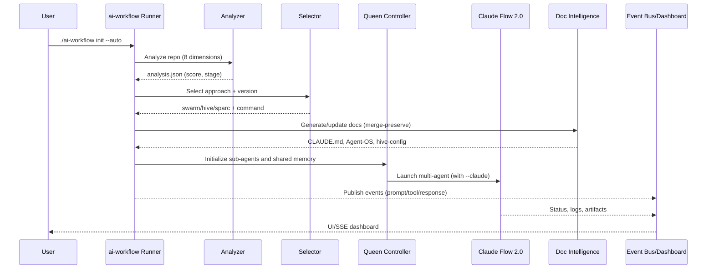

# MASTER-WORKFLOW System Audit (v3.0)

## Executive Summary

The MASTER-WORKFLOW system is a modular, production-ready AI orchestration platform that analyzes a project, selects an execution approach, and launches coordinated multi-agent work using Claude Code, Claude Flow 2.0, and Agent-OS. Version 3.0 introduces a Queen Controller that manages up to 10 concurrent sub-agents with large context windows, an event bus with dashboards, and document intelligence that preserves and upgrades existing docs.

Strengths
- Modular install per project; works with or without tmux
- Clear separation of concerns: analysis, approach selection, orchestration, documentation, and integration
- Multi-agent capabilities via Claude Flow 2.0 with SPARC methodology for enterprise work
- Safety controls: command allowlists, transactional journaling, YOLO gating in CI
- Cross-platform support (Linux/macOS/WSL/Windows)

Risks/Considerations
- Heavy reliance on external tools (Claude CLI, Claude Flow, optional MCP servers)
- tmux best experience not always available natively on Windows (process-mode fallback exists)
- YOLO mode must be carefully controlled (guardrails present, but needs team policy)
- Large-context multi-agent runs may demand system resources; dashboards recommended

---

## How It Works (End-to-End)

1) Project analysis
- Inspects repository across 8 dimensions (size, dependencies, architecture, tech stack, features, team, deployment, testing)
- Produces `.ai-dev/analysis.json` with score (0–100) and stage (idea/early/active/mature)

2) Approach selection
- Maps complexity and stage to: Simple Swarm, Hive-Mind, or Hive-Mind + SPARC
- Normalizes `CLAUDE_FLOW_VERSION` (alpha/beta/latest/stable/2.0/dev)

3) Orchestration
- Builds exact Claude Flow commands, adds `--claude` integration flags
- Optionally runs under tmux or as background processes
- Publishes events to the agent bus and exposes a dashboard on a local port

4) Documentation intelligence
- Generates or updates CLAUDE.md, Agent-OS instructions/specs, CLAUDE Flow configs
- Uses intelligent merge to preserve user customizations with 3-way strategy

5) Multi-agent execution
- Queen Controller coordinates up to 10 specialized sub-agents with shared memory
- Claude Flow executes the swarm/hive and SPARC phases when applicable

---

## Core Components

- Workflow runners
  - `workflow-runner.js` (root): full-featured runner with Queen Controller, SubAgentManager, SharedMemoryStore, MCP configurator
  - `.ai-workflow/workflow-runner.js`: modular runner optimized for installed components and process-mode fallback

- Intelligence engine
  - Complexity analyzer and approach selector
  - Smart tool selector for choosing the right engine per task
  - Event bus publisher + HTTP/SSE dashboard (status, logs, events)

- Queen Controller & SubAgent Manager
  - Spawns/monitors up to 10 sub-agents
  - Tracks resource usage, token counts, lifetimes
  - Optional tmux session per agent; process-mode fallback

- Document intelligence
  - Agent-OS Document Analyzer: discovers documents and detects customizations
  - Interactive Document Updater: 3-way merge, selective/batch update, previews, backups

- Integrations
  - Claude Code: agents and slash commands under `.claude/`
  - Claude Flow 2.0: swarm/hive/SPARC orchestration via `npx claude-flow@<ver>`
  - Agent-OS: product/spec docs scaffolding and updates under `.agent-os/`
  - MCP: dynamic registry with default server `context7` and discovery via `./ai-workflow mcp refresh`

---

## Orchestration & Decision Flow

Mermaid overview

Approach matrix (typical)
- 0–30: Simple Swarm → single fast agent
- 31–70: Hive-Mind → multi-agent
- 71–100: Hive-Mind + SPARC → phased enterprise methodology

---

## Installation & Execution Surfaces

- Installers
  - `install-modular.sh` (interactive; choose components)
  - `install-production.sh` (all components)
  - `install-standalone.sh` (per-project)
  - Windows: `install-modular.ps1`

- CLI entrypoint
  - `./ai-workflow` symlink in project root
  - Works with tmux or process-mode (fallback)

- Engine API (optional)
  - Build: `cd engine && npm ci && npm run build && npm run cli migrate && npm start`
  - Endpoints: `/health`, `/api/components`, `/api/orchestrator/*`, `/events/stream`

---

## Safety, Governance, and Observability

- Safety
  - Command allowlists and scoped write roots
  - YOLO mode gated; disabled in CI; explicit ACK required
  - Transactional journaling and rollback hooks

- Governance
  - SECURITY.md, CONTRIBUTING.md, CODE_OF_CONDUCT.md
  - Phase-based development and PR templates

- Observability
  - JSONL event bus and HTTP/SSE dashboard (default port 8787)
  - Agent metrics, approach-change events, artifacts routing

---

## Identified Gaps & Recommendations

1) Unified config surface for install/runtime
- Today: installation-config.json + various configs under `.ai-workflow/`, `.claude-flow/`.
- Recommendation: one authoritative config with per-component sections and schema validation.

2) First-run diagnostics
- Add one-shot `./ai-workflow doctor` for environment readiness, tmux availability, MCP registry status, and permissions.

3) Resource-aware defaults
- Auto-tune agent concurrency and context windows based on system resources and repository size.

4) Fine-grained doc update policies
- Expose presets (conservative, balanced, aggressive) and add per-file overrides in a config file.

5) Post-run reports
- Summarize agent outcomes, code diffs, test results, and doc changes in a single artifact with links.

---

## Conclusion

MASTER-WORKFLOW v3.0 provides a robust foundation for automated development workflows, from small fixes to enterprise-scale SPARC programs. Its modular design, multi-agent orchestration, and document intelligence make it well-suited for complex, evolving projects. The system’s safety guardrails and observability tooling enable confident use in production environments when paired with sensible team policies.

