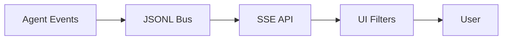
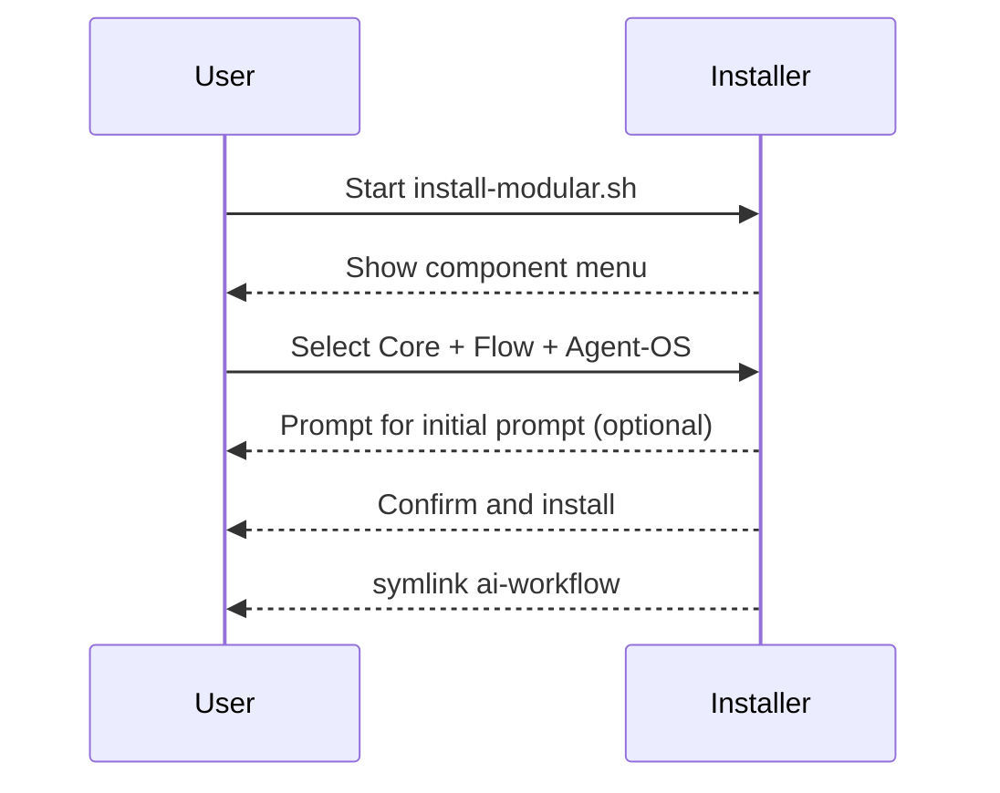

# Workflow Features and Settings (v3.0)

## Core Features
- Queen Controller: up to 10 concurrent sub-agents, 200k context each, shared memory
- Sub-Agent Manager: lifecycle, resource monitoring, tmux sessions (optional), process-mode fallback
- Intelligent Analysis: 8-dimension scoring, stage detection, tech stack recognition
- Approach Selection: Swarm, Hive-Mind, SPARC with version policy normalization
- Document Intelligence: analysis-driven generation + preservation merges, selective/batch updates, backups
- Event Bus + Dashboard: JSONL bus with SSE UI (`./ai-workflow status-dashboard`)
- MCP Integration: dynamic registry, default server `context7`, discovery via `./ai-workflow mcp refresh`
- Cross-Platform: Linux/macOS/WSL/Windows (process mode)

## Settings & Environment Variables
- `CLAUDE_FLOW_VERSION`: `alpha|beta|latest|stable|2.0|dev`
- `MCP_DEFAULT_SERVER`: defaults to `context7`
- `MCP_SERVERS`: CSV or JSON for additional MCP servers (e.g., `name=url`)
- `AGENT_BUS_PORT`: dashboard/bus port (default 8787)
- `ENABLE_AUTO_COMMIT`: tmux auto-commit (default disabled)
- `BLOCK_YOLO` or `CI=true`: blocks YOLO in CI
- `INSTALLER_KILL=1`: emergency stop for installers

## Orchestration Config Highlights
- Orchestrators: `queen-controller` (primary), `workflow-orchestrator` (fallback)
- Agents: complexity analyzer, approach selector, document customizer, SPARC manager, integration coordinator
- Workflows: initialization (init sequence), execution (swarm, hive_mind, sparc)

## Document Intelligence
- Analyzer: discovers docs and customizations
- Updater: strategies (intelligent-merge, selective, replace with backups), previews and diffs, interactive mode
- Outputs: CLAUDE.md, Agent-OS instructions/specs, hive-config updates, CONTRIBUTING/DEPLOYMENT/ARCHITECTURE

## Wireframes (Mermaid)

Dashboard (events)


Install wizard (concept)


Approach selection matrix
```
Score 0–30  → Swarm
Score 31–70 → Hive-Mind
Score 71–100→ Hive-Mind + SPARC
```

## Best Practices
- Prefer stable versions (`CLAUDE_FLOW_VERSION=stable`) for long runs
- Keep docs in sync; let the updater merge improvements
- Use the dashboard to monitor approach changes and resource usage
- Limit agents when on constrained machines; increase on servers

## Extensibility
- Add MCP servers via registry
- Add custom agents/templates under `.claude/agents/` and `.ai-workflow/agent-templates`
- Extend event bus consumers (e.g., forward to ELK/Grafana)
