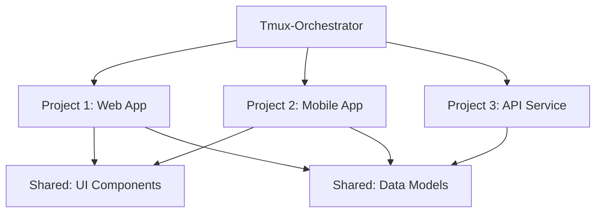
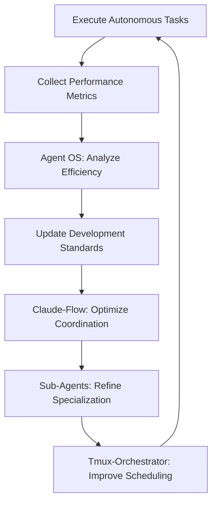

# 4-System Ultimate AI Development Workflow
## The Autonomous Development Revolution

### Executive Summary

After comprehensive analysis, this document presents the optimal 4-system integration for revolutionary AI-powered development:

1. **Tmux-Orchestrator**: 24/7 autonomous operation and persistence layer
2. **Agent OS**: Spec-driven planning and development standards  
3. **Claude-Flow**: Multi-agent coordination with 87 MCP tools + persistent memory
4. **Claude Code Sub-Agents**: Specialized execution agents

**Key Decision**: We deliberately EXCLUDE BMAD-METHOD due to 70% capability overlap and unnecessary complexity. Tmux-Orchestrator provides unique autonomous capabilities that none of the other systems offer.

**Revolutionary Capability**: Development that continues 24/7, survives computer restarts, coordinates across multiple projects, and maintains context across all sessions.

---

## Why This 4-System Integration Works

### The Honest Analysis

#### ✅ Tmux-Orchestrator: UNIQUE VALUE
- **24/7 autonomous operation** - No other system provides this
- **Persistent tmux sessions** - Survives restarts and context switches  
- **Cross-project coordination** - Manages multiple codebases simultaneously
- **Self-scheduling agents** - AI agents that plan their own work cycles
- **Zero overlap** with existing systems - Pure additive value

#### ❌ BMAD-METHOD: REDUNDANT COMPLEXITY  
- **70% overlap** with Agent OS (planning) and Claude-Flow (coordination)
- **Agent conflict** - Would compete with Sub-Agents and Claude-Flow agents
- **Configuration complexity** - Multiple overlapping systems
- **No unique value** - Story-driven development isn't superior to spec-driven

### System Architecture

```
┌─────────────────────────────────────────────────────────┐
│                 Tmux-Orchestrator                       │
│              (24/7 Autonomous Layer)                    │
│  ┌─────────────┐ ┌─────────────┐ ┌─────────────┐      │
│  │ Project A   │ │ Project B   │ │ Project C   │      │
│  │ Session     │ │ Session     │ │ Session     │      │
│  └─────────────┘ └─────────────┘ └─────────────┘      │
└─────────────────┬───────────────────────────────────────┘
                  │ orchestrates
┌─────────────────▼───────────────────────────────────────┐
│                  Agent OS                               │
│              (Planning & Standards)                     │
│  • Product specs & roadmaps                            │
│  • Development standards                               │
│  • Technical specifications                            │
└─────────────────┬───────────────────────────────────────┘
                  │ informs
┌─────────────────▼───────────────────────────────────────┐
│                Claude-Flow                              │
│         (Multi-Agent Coordination)                      │
│  • 87 MCP tools                                        │
│  • SQLite persistent memory                            │
│  • Queen-led coordination                              │
│  • Swarm & hive-mind modes                             │
└─────────────────┬───────────────────────────────────────┘
                  │ delegates to
┌─────────────────▼───────────────────────────────────────┐
│              Claude Code Sub-Agents                     │
│             (Specialized Execution)                     │
│  • Code review     • Security audit                    │
│  • Testing         • Architecture                      │
│  • Debugging       • Documentation                     │
└─────────────────────────────────────────────────────────┘
```

---

## 24/7 Autonomous Development Scenarios

### Scenario 1: The Sleeping Developer
**Setup**: You finish work at 6 PM with a complex refactoring task  
**Autonomous Workflow**:
```bash
# Before bed
tmux new-session -s "overnight-refactor"
claude-flow hive-mind spawn "microservice-extraction" 
# Tmux-Orchestrator takes over
```

**What Happens Overnight**:
1. **Hour 1-2**: Agent OS generates refactoring specifications
2. **Hour 3-4**: Claude-Flow coordinates dependency analysis across codebase  
3. **Hour 5-6**: Sub-agents begin incremental extraction
4. **Hour 7-8**: Automated testing and validation cycles
5. **Morning**: Wake up to progress report and completed phases

### Scenario 2: Multi-Project Autonomous Coordination
**Setup**: Managing 3 client projects simultaneously
**Architecture**:
```bash
# Terminal window layout
tmux new-session -s "client-coordination"
tmux new-window -t "client-coordination" -n "project-a"
tmux new-window -t "client-coordination" -n "project-b"  
tmux new-window -t "client-coordination" -n "project-c"
```

**Autonomous Operations**:
- **Project A**: Bug fixes and optimization (Sub-agents handle testing)
- **Project B**: New feature development (Claude-Flow coordinates implementation)
- **Project C**: Security audit and hardening (Agent OS maintains compliance standards)
- **Cross-Project**: Shared code library updates propagated automatically

### Scenario 3: Continuous Integration Autonomous Pipeline  
**Workflow**:
```bash
# Git hook triggered development
git commit -m "Add user authentication feature"
# Tmux-Orchestrator detects commit
# Agent OS validates against standards
# Claude-Flow spawns test coordination
# Sub-agents execute comprehensive testing
# Automatic PR creation with full test results
```

**24/7 Pipeline Benefits**:
- Tests run immediately regardless of time
- Code review happens during off-hours
- Performance optimization occurs during low-usage periods
- Documentation updates automatically as features develop

---

## Cross-Project Coordination Patterns

### Pattern 1: Shared Component Development


**Autonomous Coordination**:
- Changes to shared components trigger updates across all projects
- Cross-project testing ensures compatibility
- Version management handled automatically
- Breaking changes detected and addressed before deployment

### Pattern 2: Dependency Chain Management
**Scenario**: Microservice architecture with 12 interdependent services
**Tmux-Orchestrator Management**:
```bash
# Service dependency tracking
service-a --> service-b --> service-c
     ↓           ↓           ↓
service-d --> service-e --> service-f
```

**Autonomous Benefits**:
- Updates propagate through dependency chain automatically
- Integration testing across entire service mesh
- Performance impact analysis across all dependent services  
- Rollback coordination if any service fails

### Pattern 3: Multi-Language Project Coordination
**Setup**: Full-stack development across multiple technologies
- **Frontend**: React/TypeScript (Project A)
- **Backend**: Node.js/Express (Project B)  
- **Database**: PostgreSQL migrations (Project C)
- **Mobile**: React Native (Project D)

**Tmux-Orchestrator Coordination**:
- API changes trigger updates in frontend and mobile
- Database schema changes propagate to all dependent services
- Shared type definitions maintained across TypeScript projects
- End-to-end testing across the entire stack

---

## Setup & Configuration Guide

### Installation Order & Dependencies

#### 1. Prerequisites
```bash
# Install required tools
sudo apt-get update
sudo apt-get install tmux git curl nodejs npm

# Verify installations
tmux -V    # Should show version 3.0+
node -v    # Should show v18+
npm -v     # Should show 9+
```

#### 2. Install Core Systems
```bash
# Step 1: Install Claude Code (prerequisite for all)
npm install -g @anthropic-ai/claude-code

# Step 2: Install Agent OS
curl -fsSL https://raw.githubusercontent.com/buildermethods/agent-os/main/setup.sh | bash
bash setup-claude-code.sh

# Step 3: Install Claude-Flow
npx claude-flow@alpha init --force

# Step 4: Install Tmux-Orchestrator
git clone https://github.com/Jedward23/Tmux-Orchestrator.git
cd Tmux-Orchestrator
# Follow repository setup instructions
```

#### 3. Configure Permissions & API Access
```bash
# Enable unrestricted operation
claude --dangerously-skip-permissions

# Set required environment variables
export ANTHROPIC_API_KEY="your-api-key"
export CLAUDE_FLOW_MEMORY_PATH="$HOME/.claude-flow/memory"
export TMUX_ORCHESTRATOR_HOME="$HOME/.tmux-orchestrator"

# Add to shell profile for persistence
echo 'export ANTHROPIC_API_KEY="your-api-key"' >> ~/.bashrc
echo 'export CLAUDE_FLOW_MEMORY_PATH="$HOME/.claude-flow/memory"' >> ~/.bashrc
echo 'export TMUX_ORCHESTRATOR_HOME="$HOME/.tmux-orchestrator"' >> ~/.bashrc
```

### Project-Level Integration Configuration

#### Directory Structure
```bash
project-root/
├── .claude/
│   ├── settings.json              # Claude-Flow hooks & permissions
│   └── agents/                    # Project-specific sub-agents
│       ├── project-architect.md
│       ├── code-reviewer.md
│       ├── test-engineer.md
│       └── security-auditor.md
├── .agent-os/
│   ├── standards.md               # Development standards
│   ├── product.md                 # Product specifications  
│   └── specs/                     # Feature specifications
│       ├── user-auth.md
│       ├── data-layer.md
│       └── api-design.md
├── .claude-flow/
│   ├── config.json                # Claude-Flow settings
│   └── memory/                    # Persistent memory store
└── .tmux-orchestrator/
    ├── project.json               # Project configuration
    ├── agents/                    # Autonomous agent configs
    └── sessions/                  # Active session states
```

#### Claude Settings with Hooks
```json
{
  "hooks": {
    "user-prompt-submit-hook": "tmux send-keys -t orchestrator 'received user input' Enter",
    "tool-call-hook": "tmux send-keys -t orchestrator 'tool executed: ${TOOL_NAME}' Enter",
    "model-response-hook": "tmux send-keys -t orchestrator 'response generated' Enter"
  },
  "dangerouslySkipPermissions": true,
  "autoSave": true,
  "maxConcurrentTools": 10
}
```

#### Tmux-Orchestrator Project Configuration
```json
{
  "projectName": "autonomous-development",
  "agents": {
    "orchestrator": {
      "role": "coordination",
      "session": "main",
      "autoStart": true
    },
    "project-manager": {
      "role": "task-management", 
      "session": "pm",
      "checkInInterval": "2h"
    },
    "engineers": [
      {
        "name": "backend-engineer",
        "session": "backend",
        "specialization": "api-development"
      },
      {
        "name": "frontend-engineer", 
        "session": "frontend",
        "specialization": "ui-development"
      }
    ]
  },
  "integrations": {
    "agent-os": true,
    "claude-flow": true,
    "sub-agents": true
  }
}
```

---

## Autonomous Workflow Examples

### Example 1: Full-Stack Feature Development (24/7)

**Trigger**: New feature request submitted
**Autonomous Process**:

#### Phase 1: Planning (Hours 1-2)
```bash
# Tmux-Orchestrator detects new feature request
tmux send-keys -t orchestrator "New feature: User Profile Management" Enter
# Agent OS generates specifications
/plan-product --feature "user-profile-management"
/create-spec --detailed --acceptance-criteria
```

#### Phase 2: Architecture (Hours 3-4)  
```bash
# Claude-Flow coordinates architecture design
claude-flow hive-mind spawn "user-profile-architecture"
# Sub-agents contribute specialized input
# project-architect: Database schema design
# security-auditor: Security requirements analysis
# api-designer: RESTful endpoint specification
```

#### Phase 3: Implementation (Hours 5-12)
```bash
# Parallel development streams
tmux new-window -t development -n "backend"
tmux new-window -t development -n "frontend" 
tmux new-window -t development -n "database"

# Backend development
claude-flow swarm "implement user profile API endpoints"
# Frontend development  
claude-flow swarm "create user profile UI components"
# Database development
claude-flow swarm "create user profile database migrations"
```

#### Phase 4: Integration & Testing (Hours 13-16)
```bash
# Automated integration testing
tmux send-keys -t testing "run integration test suite" Enter
# Sub-agent: test-engineer performs comprehensive testing
# Cross-component compatibility validation
# Performance impact analysis
```

#### Phase 5: Documentation & Deployment Prep (Hours 17-24)
```bash
# Automated documentation generation
claude-flow swarm "generate API documentation for user profiles"
# Deployment preparation
claude-flow swarm "prepare user profile feature for staging deployment"
# Security audit
# Performance optimization
```

**Result**: Wake up to fully implemented, tested, documented feature ready for review

### Example 2: Legacy Codebase Migration (Multi-Day Autonomous)

**Project**: Migrate 50,000-line PHP monolith to microservices
**Autonomous Strategy**:

#### Day 1: Analysis & Planning
```bash
# Tmux-Orchestrator initializes long-term project
tmux new-session -s "legacy-migration"
# Agent OS analyzes existing codebase
/analyze-product --codebase-size large --tech-debt-assessment
# Claude-Flow coordinates dependency mapping
claude-flow hive-mind spawn "monolith-analysis"
```

#### Days 2-7: Incremental Extraction  
```bash
# Daily autonomous extraction cycles
# Day 2: User service extraction
# Day 3: Product service extraction  
# Day 4: Order service extraction
# Day 5: Payment service extraction
# Day 6: Notification service extraction
# Day 7: Integration testing & optimization
```

#### Week 2+: Continuous Integration
```bash
# Ongoing autonomous maintenance
# Performance monitoring
# Bug fixes and optimizations  
# Documentation updates
# Security patches
```

**Benefits**:
- Migration continues 24/7 without human intervention
- Context maintained across multiple days/weeks
- Consistent progress regardless of developer availability
- Comprehensive testing and validation throughout

### Example 3: Multi-Client Agency Workflow

**Scenario**: Managing 5 client projects with different tech stacks
**Autonomous Coordination**:

```bash
# Master orchestration session
tmux new-session -s "agency-coordination"

# Client project sessions
tmux new-window -t "agency-coordination" -n "client-a-react"
tmux new-window -t "agency-coordination" -n "client-b-vue" 
tmux new-window -t "agency-coordination" -n "client-c-angular"
tmux new-window -t "agency-coordination" -n "client-d-mobile"
tmux new-window -t "agency-coordination" -n "client-e-backend"
```

**Autonomous Benefits**:
- Each client gets dedicated development attention
- Cross-client learning and optimization  
- Consistent quality standards via Agent OS
- Resource sharing and efficiency optimization
- 24/7 development capacity across all clients

---

## Advanced Integration Patterns

### Pattern 1: Self-Improving Autonomous Workflow



**Implementation**:
```bash
# Performance monitoring hooks
tmux send-keys -t metrics "task_completed: $(date) - efficiency: 85%" Enter
# Agent OS analyzes patterns and updates standards
# Claude-Flow adjusts coordination strategies
# Sub-agents refine their specialized behaviors
# Tmux-Orchestrator optimizes scheduling based on performance data
```

### Pattern 2: Event-Driven Autonomous Development

**Triggers**:
- Git commits → Automatic testing and integration
- Issue creation → Autonomous bug investigation  
- Performance alerts → Automatic optimization tasks
- Security vulnerabilities → Immediate assessment and patching

**Implementation**:
```bash
# Git hook integration
echo '#!/bin/bash
tmux send-keys -t orchestrator "git_commit_detected: $1" Enter' > .git/hooks/post-commit
chmod +x .git/hooks/post-commit

# Issue tracking integration
# Performance monitoring integration  
# Security alert integration
```

### Pattern 3: Cross-System Memory & Learning

**Persistent Learning Architecture**:
```bash
# Shared memory across all systems
~/.ai-development-memory/
├── agent-os-learnings/        # Standards refinements
├── claude-flow-optimizations/ # Coordination improvements  
├── sub-agent-expertise/       # Specialized knowledge
└── tmux-orchestrator-patterns/# Scheduling optimizations
```

**Benefits**:
- Each system learns from all others
- Optimization insights shared across projects
- Continuous improvement in autonomous capabilities
- Reduced repetition and increased efficiency

---

## Performance Optimization & Best Practices

### Resource Management

#### CPU & Memory Optimization
```bash
# Tmux session resource limits
tmux set-option -g default-terminal "screen-256color"
tmux set-option -g history-limit 10000

# Claude-Flow memory management
export CLAUDE_FLOW_MAX_MEMORY="2GB"
export CLAUDE_FLOW_CACHE_SIZE="500MB"

# Agent OS optimization
export AGENT_OS_CONTEXT_LIMIT="50000"
```

#### Cost Optimization Strategies
1. **Intelligent Scheduling**: Run expensive operations during off-peak API pricing
2. **Context Pruning**: Limit sub-agent context to essential information
3. **Batch Processing**: Group similar tasks for efficiency
4. **Smart Caching**: Use Claude-Flow's persistent memory to avoid redundant API calls
5. **Selective Tool Access**: Restrict sub-agents to necessary tools only

### Security Best Practices

#### API Key Management
```bash
# Secure API key storage
echo 'export ANTHROPIC_API_KEY="$(cat ~/.anthropic/api-key)"' >> ~/.bashrc
chmod 600 ~/.anthropic/api-key

# Session isolation
tmux new-session -s "secure-development" \; \
  set-environment ANTHROPIC_API_KEY "$ANTHROPIC_API_KEY"
```

#### Autonomous Operation Security
```bash
# Git commit signing for autonomous commits
git config --global commit.gpgsign true
git config --global user.signingkey [your-gpg-key]

# Automated security scanning
claude-flow swarm "security scan all autonomous commits"
```

### Monitoring & Debugging

#### Health Monitoring Dashboard
```bash
# Tmux status bar with system health
tmux set-status-right "#[fg=green]Agent-OS: ✓ #[fg=blue]Claude-Flow: ✓ #[fg=yellow]Sub-Agents: 4 active"

# Log aggregation
tail -f ~/.claude-flow/logs/coordination.log \
       ~/.agent-os/logs/planning.log \
       ~/.tmux-orchestrator/logs/autonomous.log
```

#### Debugging Autonomous Workflows
```bash
# Debug mode activation
export TMUX_ORCHESTRATOR_DEBUG=true
export CLAUDE_FLOW_DEBUG=true

# Session recording for analysis
tmux pipe-pane -o 'cat >> ~/.debug/session-$(date +%Y%m%d-%H%M%S).log'
```

---

## Troubleshooting & Common Issues

### Issue 1: Agent Coordination Conflicts
**Symptoms**: Multiple agents trying to modify the same files
**Solution**:
```bash
# File locking mechanism
echo "#!/bin/bash
flock -n /tmp/file-\$1.lock -c 'your-command'" > ~/.claude/scripts/safe-edit
chmod +x ~/.claude/scripts/safe-edit
```

### Issue 2: Context Window Exhaustion
**Symptoms**: Agents losing context mid-task
**Solution**:
```bash
# Context rotation strategy
export TMUX_ORCHESTRATOR_CONTEXT_ROTATION=true
# Automatic context summarization
claude-flow swarm "summarize current context for persistence"
```

### Issue 3: Resource Exhaustion  
**Symptoms**: System slowdown, high API usage
**Solution**:
```bash
# Resource monitoring and throttling
export CLAUDE_FLOW_MAX_CONCURRENT_AGENTS=3
export TMUX_ORCHESTRATOR_THROTTLE_INTERVAL=30s
```

### Issue 4: Lost Session Recovery
**Symptoms**: Tmux sessions lost due to system restart
**Solution**:
```bash
# Session persistence
tmux-resurrect save
# Automatic session restore on startup
echo 'tmux-resurrect restore' >> ~/.bashrc
```

---

## Future Evolution & Extensibility

### Planned Enhancements

#### Phase 1: Enhanced Autonomy
- **Self-Healing Workflows**: Automatic error detection and correction
- **Dynamic Resource Allocation**: Intelligent scaling based on workload
- **Cross-Project Learning**: Insights from one project applied to others

#### Phase 2: Team Integration
- **Multi-Developer Coordination**: Autonomous coordination between human developers
- **Stakeholder Communication**: Automatic progress reports and status updates
- **Quality Assurance Integration**: Autonomous testing and validation workflows

#### Phase 3: Advanced AI Capabilities
- **Predictive Development**: Anticipating future needs and preparing solutions
- **Architectural Evolution**: Autonomous system architecture improvements
- **Performance Optimization**: Continuous autonomous performance enhancements

### Extensibility Framework

#### Custom Agent Development
```bash
# Template for custom autonomous agent
mkdir ~/.tmux-orchestrator/custom-agents/
cp agent-template.sh ~/.tmux-orchestrator/custom-agents/my-agent.sh
# Modify for specialized needs
```

#### Integration Hooks
```bash
# Custom integration points
~/.claude/hooks/
├── pre-autonomous-task.sh
├── post-autonomous-task.sh
├── error-recovery.sh
└── progress-notification.sh
```

---

## Conclusion: The Autonomous Development Revolution

This 4-system integration represents a fundamental shift in software development:

### What We've Achieved
- **24/7 Development Capability**: Code that writes itself around the clock
- **Multi-Project Coordination**: Simultaneous autonomous development across multiple codebases  
- **Persistent Context**: Development context that survives system restarts and extends across weeks
- **Specialized Expertise**: AI agents with deep, focused knowledge in specific domains
- **Self-Improving Workflows**: Systems that learn and optimize themselves over time

### Why This Integration Works
1. **No Redundancy**: Each system provides unique, non-overlapping capabilities
2. **Clear Hierarchy**: Well-defined integration layers with clear responsibilities
3. **Autonomous Operation**: True 24/7 development without human intervention
4. **Scalable Architecture**: Can handle everything from solo projects to enterprise development
5. **Cost Effective**: Optimized resource usage and intelligent API management

### The Bottom Line
**This isn't just about using AI to help with development. This is about creating autonomous development systems that work while you sleep, coordinate across multiple projects, and continuously improve their own capabilities.**

The combination of structured planning (Agent OS), intelligent coordination (Claude-Flow), specialized execution (Sub-Agents), and autonomous persistence (Tmux-Orchestrator) creates something greater than the sum of its parts: a true autonomous development partner.

**The future of software development is autonomous, persistent, and intelligent. This integration makes that future available today.**

---

*"Development that continues while you dream, coordinates what you cannot track, and builds what you envision - the 4-System Ultimate AI Development Workflow represents the next evolution in human-AI collaborative software development."*