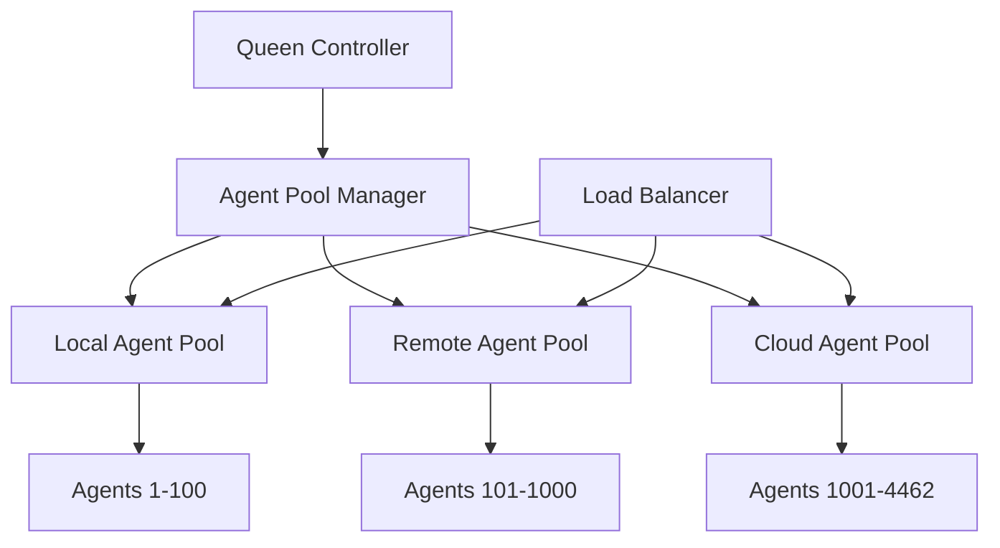

# Claude Flow 2.0 - Advanced Features & Unlimited Scaling

This guide covers Claude Flow 2.0's advanced features, including unlimited agent scaling, advanced MCP server integration, enterprise features, and power-user configurations.

## Table of Contents

- [Unlimited Agent Scaling](#unlimited-agent-scaling)
- [Advanced MCP Server Integration](#advanced-mcp-server-integration)
- [Enterprise Features](#enterprise-features)
- [Custom Agent Development](#custom-agent-development)
- [Advanced Orchestration](#advanced-orchestration)
- [Performance Optimization](#performance-optimization)
- [Security & Compliance](#security--compliance)
- [Multi-Environment Management](#multi-environment-management)
- [API & Integration](#api--integration)
- [Monitoring & Analytics](#monitoring--analytics)

## Unlimited Agent Scaling

Claude Flow 2.0 supports scaling from 1 to 4,462 concurrent agents with intelligent load balancing and resource management.

### Understanding Agent Scaling

#### Scaling Architecture


### Scaling Configuration

#### Basic Scaling Setup
```bash
# Configure unlimited scaling
npx claude-flow@2.0.0 config set scaling.unlimited true
npx claude-flow@2.0.0 config set scaling.maxAgents 4462

# Set scaling thresholds
npx claude-flow@2.0.0 config set scaling.triggers.cpu 80
npx claude-flow@2.0.0 config set scaling.triggers.memory 75
npx claude-flow@2.0.0 config set scaling.triggers.queueDepth 100

# Enable auto-scaling
npx claude-flow@2.0.0 config set scaling.autoScale true
```

#### Advanced Scaling Policies
```json
{
  "scaling": {
    "policies": [
      {
        "name": "cpu-based",
        "trigger": "cpu > 80",
        "action": "scale_up",
        "factor": 1.5,
        "cooldown": 300
      },
      {
        "name": "queue-based",
        "trigger": "queue_depth > 50",
        "action": "scale_up",
        "factor": 2.0,
        "cooldown": 180
      },
      {
        "name": "time-based",
        "trigger": "schedule.peak_hours",
        "action": "pre_scale",
        "target": 200,
        "schedule": "0 8 * * 1-5"
      }
    ]
  }
}
```

### Massive Scale Deployment

#### 1000+ Agent Configuration
```bash
# Initialize for massive scale
npx claude-flow@2.0.0 init --approach sparc --agents 1000 --preset enterprise-scale

# Configure resource limits
npx claude-flow@2.0.0 config set resources.memory.total 64GB
npx claude-flow@2.0.0 config set resources.cpu.total 32
npx claude-flow@2.0.0 config set resources.network.bandwidth 10Gbps

# Enable distributed processing
npx claude-flow@2.0.0 config set distribution.enabled true
npx claude-flow@2.0.0 config set distribution.nodes 10
```

#### Multi-Node Scaling
```bash
# Setup cluster for ultimate scaling
npx claude-flow@2.0.0 cluster init --nodes 20 --max-agents 4462

# Configure node types
npx claude-flow@2.0.0 cluster configure \
  --master-nodes 3 \
  --worker-nodes 15 \
  --gpu-nodes 2

# Deploy across nodes
npx claude-flow@2.0.0 cluster deploy --distribute-agents
```

### Scaling Strategies

#### Horizontal Scaling
```bash
# Scale across multiple machines
npx claude-flow@2.0.0 scale horizontal \
  --nodes node1.example.com,node2.example.com,node3.example.com \
  --agents-per-node 200

# Cloud scaling with AWS
npx claude-flow@2.0.0 scale cloud aws \
  --instance-type c5.4xlarge \
  --max-instances 50 \
  --agents-per-instance 100
```

#### Vertical Scaling
```bash
# Scale within single machine
npx claude-flow@2.0.0 scale vertical \
  --memory-per-agent 512MB \
  --cpu-per-agent 0.1 \
  --max-agents-local 500
```

#### Hybrid Scaling
```bash
# Combine local and cloud scaling
npx claude-flow@2.0.0 scale hybrid \
  --local-agents 100 \
  --cloud-agents 1000 \
  --failover-enabled true
```

## Advanced MCP Server Integration

Claude Flow 2.0's MCP ecosystem includes 125+ servers with advanced integration capabilities.

### MCP Server Categories

#### Database Servers (25+ servers)
```bash
# SQL Databases
npx claude-flow@2.0.0 mcp enable postgresql mysql sqlite oracle
npx claude-flow@2.0.0 mcp enable mariadb cockroachdb yugabytedb

# NoSQL Databases  
npx claude-flow@2.0.0 mcp enable mongodb redis cassandra elasticsearch
npx claude-flow@2.0.0 mcp enable dynamodb couchbase neo4j

# Time Series & Analytics
npx claude-flow@2.0.0 mcp enable influxdb timescaledb clickhouse
```

#### Cloud Platforms (30+ servers)
```bash
# Major Cloud Providers
npx claude-flow@2.0.0 mcp enable aws-ec2 aws-s3 aws-rds aws-lambda
npx claude-flow@2.0.0 mcp enable gcp-compute gcp-storage gcp-bigquery
npx claude-flow@2.0.0 mcp enable azure-vm azure-storage azure-sql

# Platform-as-a-Service
npx claude-flow@2.0.0 mcp enable heroku vercel netlify railway
npx claude-flow@2.0.0 mcp enable digitalocean linode vultr
```

#### Development Tools (35+ servers)
```bash
# Version Control
npx claude-flow@2.0.0 mcp enable git github gitlab bitbucket

# CI/CD
npx claude-flow@2.0.0 mcp enable jenkins github-actions gitlab-ci
npx claude-flow@2.0.0 mcp enable circleci travis-ci azure-devops

# Containerization
npx claude-flow@2.0.0 mcp enable docker kubernetes helm
npx claude-flow@2.0.0 mcp enable docker-compose portainer
```

#### Monitoring & Analytics (20+ servers)
```bash
# Monitoring
npx claude-flow@2.0.0 mcp enable prometheus grafana datadog
npx claude-flow@2.0.0 mcp enable newrelic splunk elastic-apm

# Analytics
npx claude-flow@2.0.0 mcp enable google-analytics mixpanel amplitude
npx claude-flow@2.0.0 mcp enable hotjar segment
```

### Custom MCP Server Development

#### Creating Custom Servers
```bash
# Generate MCP server template
npx claude-flow@2.0.0 mcp create-server --name company-api

# Configure server capabilities
npx claude-flow@2.0.0 mcp configure-server company-api \
  --capabilities read,write,execute \
  --auth-type oauth2 \
  --rate-limit 1000/hour
```

#### Server Configuration File
```json
{
  "name": "company-api",
  "version": "1.0.0",
  "description": "Internal company API integration",
  "capabilities": ["read", "write", "execute"],
  "endpoints": {
    "base_url": "https://api.company.com/v1",
    "auth": {
      "type": "oauth2",
      "client_id": "${COMPANY_API_CLIENT_ID}",
      "client_secret": "${COMPANY_API_CLIENT_SECRET}",
      "token_url": "https://api.company.com/oauth/token"
    }
  },
  "operations": [
    {
      "name": "list_users",
      "method": "GET",
      "path": "/users",
      "parameters": ["limit", "offset"],
      "response_type": "json"
    },
    {
      "name": "create_user",
      "method": "POST",
      "path": "/users",
      "body_schema": "user_create_schema.json"
    }
  ],
  "schemas": {
    "user_create_schema.json": {
      "type": "object",
      "properties": {
        "name": {"type": "string"},
        "email": {"type": "string", "format": "email"}
      },
      "required": ["name", "email"]
    }
  }
}
```

#### Deploy Custom Server
```bash
# Deploy to Claude Flow registry
npx claude-flow@2.0.0 mcp deploy-server company-api

# Test server connectivity
npx claude-flow@2.0.0 mcp test company-api

# Enable for project
npx claude-flow@2.0.0 mcp enable company-api
```

### Advanced MCP Features

#### Server Composition
```bash
# Create composite server from multiple sources
npx claude-flow@2.0.0 mcp compose \
  --name data-pipeline \
  --servers postgresql,redis,elasticsearch \
  --workflow data-etl

# Configure data flow between servers
npx claude-flow@2.0.0 mcp flow \
  --from postgresql \
  --transform redis \
  --to elasticsearch
```

#### Server Proxying and Load Balancing
```bash
# Setup load-balanced server pool
npx claude-flow@2.0.0 mcp pool create \
  --name db-pool \
  --servers postgresql-1,postgresql-2,postgresql-3 \
  --strategy round-robin

# Configure failover
npx claude-flow@2.0.0 mcp pool failover \
  --pool db-pool \
  --health-check "SELECT 1" \
  --timeout 5s
```

## Enterprise Features

### Multi-Tenant Architecture

#### Tenant Configuration
```bash
# Enable multi-tenancy
npx claude-flow@2.0.0 config set enterprise.multiTenant true

# Create tenant
npx claude-flow@2.0.0 tenant create \
  --name client-a \
  --resources cpu:8,memory:16GB \
  --agents-limit 100

# Isolate tenant resources
npx claude-flow@2.0.0 tenant isolate client-a \
  --network-isolation true \
  --data-encryption true
```

#### Tenant Management
```bash
# List all tenants
npx claude-flow@2.0.0 tenant list

# Scale tenant resources
npx claude-flow@2.0.0 tenant scale client-a --agents 200

# Monitor tenant usage
npx claude-flow@2.0.0 tenant monitor client-a --metrics cpu,memory,agents
```

### Enterprise Security

#### Advanced Authentication
```bash
# Configure SSO with SAML
npx claude-flow@2.0.0 auth configure saml \
  --idp-url https://company.okta.com \
  --cert-file saml-cert.pem

# Enable LDAP authentication
npx claude-flow@2.0.0 auth configure ldap \
  --server ldap://company.com \
  --base-dn "ou=users,dc=company,dc=com"

# Multi-factor authentication
npx claude-flow@2.0.0 auth configure mfa \
  --provider totp \
  --backup-codes true
```

#### Role-Based Access Control (RBAC)
```bash
# Define roles
npx claude-flow@2.0.0 rbac create-role \
  --name developer \
  --permissions read,write,execute-safe

npx claude-flow@2.0.0 rbac create-role \
  --name admin \
  --permissions all

# Assign roles to users
npx claude-flow@2.0.0 rbac assign \
  --user john.doe@company.com \
  --role developer

# Create policy
npx claude-flow@2.0.0 rbac create-policy \
  --name production-access \
  --resources "env:production" \
  --actions "read,monitor" \
  --principals "group:ops-team"
```

### Audit and Compliance

#### Comprehensive Auditing
```bash
# Enable full audit logging
npx claude-flow@2.0.0 config set audit.level comprehensive
npx claude-flow@2.0.0 config set audit.retention 7years

# Configure audit destinations
npx claude-flow@2.0.0 audit configure \
  --destinations syslog,s3,elasticsearch \
  --format json

# Generate compliance reports
npx claude-flow@2.0.0 audit report \
  --type sox-compliance \
  --period 2023-Q4
```

#### Compliance Frameworks
```bash
# Enable SOC 2 compliance
npx claude-flow@2.0.0 compliance enable soc2
npx claude-flow@2.0.0 compliance configure soc2 \
  --controls all \
  --evidence-collection automatic

# HIPAA compliance for healthcare
npx claude-flow@2.0.0 compliance enable hipaa
npx claude-flow@2.0.0 compliance encrypt-phi true

# GDPR compliance
npx claude-flow@2.0.0 compliance enable gdpr
npx claude-flow@2.0.0 compliance configure gdpr \
  --data-retention 24months \
  --right-to-deletion true
```

## Custom Agent Development

### Agent SDK

#### Creating Custom Agents
```bash
# Generate agent template
npx claude-flow@2.0.0 agent create \
  --name custom-analyzer \
  --template specialist \
  --language typescript

# Agent capabilities configuration
npx claude-flow@2.0.0 agent configure custom-analyzer \
  --capabilities analysis,reporting,optimization \
  --memory-limit 1GB \
  --concurrency 5
```

#### Agent Development Framework
```typescript
// custom-analyzer.ts
import { Agent, Task, Result } from '@claude-flow/agent-sdk';

export class CustomAnalyzer extends Agent {
  name = 'custom-analyzer';
  capabilities = ['analysis', 'reporting', 'optimization'];
  
  async processTask(task: Task): Promise<Result> {
    // Custom logic implementation
    const analysis = await this.analyzeCode(task.input);
    const optimizations = await this.suggestOptimizations(analysis);
    
    return {
      success: true,
      data: {
        analysis,
        optimizations,
        confidence: 0.95
      },
      metadata: {
        processingTime: Date.now() - task.startTime,
        resourcesUsed: this.getResourceUsage()
      }
    };
  }
  
  private async analyzeCode(input: string): Promise<AnalysisResult> {
    // Implementation details
  }
  
  private async suggestOptimizations(analysis: AnalysisResult): Promise<Optimization[]> {
    // Implementation details
  }
}
```

#### Agent Deployment
```bash
# Build agent
npx claude-flow@2.0.0 agent build custom-analyzer

# Test agent locally
npx claude-flow@2.0.0 agent test custom-analyzer \
  --input sample-task.json

# Deploy to agent pool
npx claude-flow@2.0.0 agent deploy custom-analyzer \
  --count 3 \
  --priority high

# Monitor agent performance
npx claude-flow@2.0.0 agent monitor custom-analyzer
```

### Agent Specialization

#### Domain-Specific Agents
```bash
# Financial services agent
npx claude-flow@2.0.0 agent create fintech-specialist \
  --domain finance \
  --regulations pci-dss,sox \
  --integrations plaid,stripe,quickbooks

# Healthcare agent
npx claude-flow@2.0.0 agent create healthcare-specialist \
  --domain healthcare \
  --compliance hipaa,hitech \
  --integrations hl7,fhir,epic

# E-commerce agent
npx claude-flow@2.0.0 agent create ecommerce-specialist \
  --domain retail \
  --platforms shopify,magento,woocommerce \
  --integrations payment,inventory,shipping
```

## Advanced Orchestration

### Workflow Orchestration

#### Complex Workflow Definition
```yaml
# advanced-workflow.yaml
name: advanced-ci-cd-pipeline
description: Enterprise CI/CD with security and compliance
version: 2.0

stages:
  - name: preparation
    parallel: false
    agents:
      - type: project-analyzer
        count: 1
        tasks:
          - analyze-dependencies
          - security-scan-preparation
          
  - name: build-and-test
    parallel: true
    depends_on: [preparation]
    agents:
      - type: build-specialist
        count: 3
        tasks:
          - compile-application
          - run-unit-tests
          - generate-coverage-report
      
      - type: security-scanner
        count: 2  
        tasks:
          - static-analysis
          - dependency-vulnerability-scan
          - container-security-scan
          
  - name: integration-testing
    parallel: false
    depends_on: [build-and-test]
    agents:
      - type: test-orchestrator
        count: 1
        config:
          environments: [staging, integration]
          test-suites: [api, ui, performance]
          
  - name: compliance-check
    parallel: true
    depends_on: [integration-testing]
    agents:
      - type: compliance-auditor
        count: 1
        tasks:
          - sox-compliance-check
          - pci-dss-validation
          - gdpr-compliance-verify
          
  - name: deployment
    parallel: false
    depends_on: [compliance-check]
    agents:
      - type: deployment-manager
        count: 1
        config:
          strategy: blue-green
          environments: [production]
          rollback-enabled: true

conditions:
  - name: security-gate
    rule: "security-scan.vulnerabilities.critical == 0"
    action: stop-pipeline
    
  - name: performance-gate  
    rule: "performance-test.response-time < 200ms"
    action: continue
    
  - name: compliance-gate
    rule: "compliance-check.all.passed == true"
    action: continue

notifications:
  - type: slack
    channel: "#deployments"
    events: [success, failure, gate-failure]
    
  - type: email
    recipients: ["team@company.com"]
    events: [failure, compliance-failure]
```

#### Workflow Execution
```bash
# Deploy workflow
npx claude-flow@2.0.0 workflow deploy advanced-ci-cd-pipeline

# Execute with parameters
npx claude-flow@2.0.0 workflow execute advanced-ci-cd-pipeline \
  --branch main \
  --environment production \
  --approval-required true

# Monitor execution
npx claude-flow@2.0.0 workflow monitor advanced-ci-cd-pipeline \
  --real-time true
```

### Dynamic Orchestration

#### AI-Powered Task Distribution
```bash
# Enable AI orchestration
npx claude-flow@2.0.0 config set orchestration.ai.enabled true

# Configure AI decision-making
npx claude-flow@2.0.0 orchestration configure-ai \
  --model gpt-4 \
  --decision-confidence 0.8 \
  --learning-enabled true

# Train orchestrator on project patterns
npx claude-flow@2.0.0 orchestration train \
  --data-source project-history \
  --optimize-for speed,quality,cost
```

## Performance Optimization

### Advanced Performance Tuning

#### Memory Optimization
```bash
# Configure advanced memory management
npx claude-flow@2.0.0 config set performance.memory.gc aggressive
npx claude-flow@2.0.0 config set performance.memory.pool.size 4GB
npx claude-flow@2.0.0 config set performance.memory.compression true

# Enable memory pooling per agent type
npx claude-flow@2.0.0 config set performance.memory.pools \
  '{"code-analyzer": "512MB", "test-runner": "256MB", "security-scanner": "1GB"}'
```

#### CPU Optimization
```bash
# Configure CPU affinity
npx claude-flow@2.0.0 config set performance.cpu.affinity true
npx claude-flow@2.0.0 config set performance.cpu.cores.dedicated 8

# Enable NUMA optimization
npx claude-flow@2.0.0 config set performance.numa.enabled true
npx claude-flow@2.0.0 config set performance.numa.policy interleave
```

#### Network Optimization
```bash
# Configure connection pooling
npx claude-flow@2.0.0 config set network.pools.size 100
npx claude-flow@2.0.0 config set network.pools.keepalive true

# Enable compression
npx claude-flow@2.0.0 config set network.compression.enabled true
npx claude-flow@2.0.0 config set network.compression.level 6
```

### Performance Monitoring

#### Real-time Metrics
```bash
# Start performance monitoring
npx claude-flow@2.0.0 monitor performance \
  --metrics cpu,memory,network,disk \
  --interval 1s \
  --alerts true

# Set up performance alerts
npx claude-flow@2.0.0 alerts create \
  --name high-cpu \
  --condition "cpu > 90" \
  --action scale-up

npx claude-flow@2.0.0 alerts create \
  --name memory-pressure \
  --condition "memory > 85" \
  --action optimize-memory
```

#### Performance Benchmarking
```bash
# Run performance benchmarks
npx claude-flow@2.0.0 benchmark \
  --agents 100,500,1000 \
  --tasks 1000 \
  --duration 10m

# Compare configurations
npx claude-flow@2.0.0 benchmark compare \
  --config-a default \
  --config-b optimized \
  --report detailed
```

## Security & Compliance

### Advanced Security Features

#### Zero-Trust Architecture
```bash
# Enable zero-trust security
npx claude-flow@2.0.0 security enable zero-trust

# Configure identity verification
npx claude-flow@2.0.0 security configure identity \
  --verification continuous \
  --risk-scoring enabled \
  --anomaly-detection true

# Network microsegmentation
npx claude-flow@2.0.0 security network-segments \
  --create production,staging,development \
  --isolation strict
```

#### Encryption and Data Protection
```bash
# Enable end-to-end encryption
npx claude-flow@2.0.0 security encryption \
  --mode end-to-end \
  --algorithm AES-256-GCM \
  --key-rotation daily

# Configure data classification
npx claude-flow@2.0.0 security classify-data \
  --levels public,internal,confidential,restricted \
  --auto-classification true

# Enable data loss prevention
npx claude-flow@2.0.0 security dlp \
  --scan-outbound true \
  --block-sensitive-data true \
  --patterns pii,credit-card,ssn
```

### Compliance Automation

#### Automated Compliance Monitoring
```bash
# Setup compliance monitoring
npx claude-flow@2.0.0 compliance monitor \
  --frameworks sox,pci-dss,hipaa,gdpr \
  --continuous true \
  --reporting monthly

# Configure compliance rules
npx claude-flow@2.0.0 compliance rules \
  --framework sox \
  --controls 302,404,409 \
  --enforcement strict

# Generate compliance dashboards
npx claude-flow@2.0.0 compliance dashboard \
  --frameworks all \
  --metrics compliance-score,violations,remediation-time
```

## Multi-Environment Management

### Environment Orchestration

#### Multi-Environment Setup
```bash
# Create environment hierarchy
npx claude-flow@2.0.0 env create development \
  --agents 10 \
  --resources cpu:4,memory:8GB

npx claude-flow@2.0.0 env create staging \
  --agents 25 \
  --resources cpu:8,memory:16GB \
  --parent development

npx claude-flow@2.0.0 env create production \
  --agents 100 \
  --resources cpu:32,memory:64GB \
  --parent staging
```

#### Environment Promotion
```bash
# Configure promotion pipeline
npx claude-flow@2.0.0 env promotion-pipeline \
  --stages development,staging,production \
  --gates security-scan,performance-test,approval

# Promote between environments
npx claude-flow@2.0.0 env promote \
  --from staging \
  --to production \
  --validate true \
  --rollback-enabled true
```

### Configuration Management

#### Environment-Specific Configuration
```bash
# Set environment-specific configs
npx claude-flow@2.0.0 config set --env development agents.count 5
npx claude-flow@2.0.0 config set --env staging agents.count 20
npx claude-flow@2.0.0 config set --env production agents.count 100

# Configure environment promotion rules
npx claude-flow@2.0.0 config set promotion.rules \
  '{"staging": {"min-test-coverage": 90}, "production": {"min-test-coverage": 95}}'
```

## API & Integration

### REST API

#### Advanced API Configuration
```bash
# Enable advanced API features
npx claude-flow@2.0.0 api configure \
  --version 2.0 \
  --rate-limiting 1000/hour \
  --authentication oauth2 \
  --cors-enabled true

# API documentation generation
npx claude-flow@2.0.0 api docs generate \
  --format openapi-3.0 \
  --output api-docs/

# Enable API versioning
npx claude-flow@2.0.0 api versioning \
  --strategy header \
  --versions 1.0,2.0 \
  --default 2.0
```

#### Custom API Endpoints
```bash
# Create custom endpoints
npx claude-flow@2.0.0 api endpoint create \
  --path "/api/v2/custom/analyze" \
  --method POST \
  --handler custom-analyzer \
  --auth required

# Configure webhooks
npx claude-flow@2.0.0 api webhook create \
  --url https://your-app.com/webhooks/claude-flow \
  --events task-completed,agent-scaled,error-occurred
```

### GraphQL API

#### Enable GraphQL
```bash
# Enable GraphQL API
npx claude-flow@2.0.0 api graphql enable

# Configure GraphQL schema
npx claude-flow@2.0.0 api graphql schema \
  --introspection true \
  --playground true \
  --subscriptions true

# Custom resolvers
npx claude-flow@2.0.0 api graphql resolver create \
  --name customAnalysis \
  --type Query \
  --handler custom-analysis-resolver
```

## Monitoring & Analytics

### Advanced Monitoring

#### Comprehensive Metrics Collection
```bash
# Enable advanced monitoring
npx claude-flow@2.0.0 monitoring enable \
  --metrics system,application,business \
  --retention 90d \
  --resolution 1s

# Configure custom metrics
npx claude-flow@2.0.0 monitoring metric create \
  --name task-completion-rate \
  --type gauge \
  --labels agent-type,priority \
  --collection-interval 10s

# Set up alerting rules
npx claude-flow@2.0.0 monitoring alert create \
  --name agent-failure-rate \
  --condition "rate(agent_failures[5m]) > 0.1" \
  --action restart-agent,notify-ops
```

#### Business Intelligence Dashboard
```bash
# Create BI dashboard
npx claude-flow@2.0.0 analytics dashboard create \
  --name business-metrics \
  --metrics throughput,cost-per-task,quality-score \
  --refresh-interval 5m

# Configure data pipeline
npx claude-flow@2.0.0 analytics pipeline create \
  --name metrics-etl \
  --sources logs,metrics,events \
  --destination data-warehouse \
  --schedule "*/15 * * * *"
```

### Predictive Analytics

#### Machine Learning Integration
```bash
# Enable predictive analytics
npx claude-flow@2.0.0 analytics ml enable

# Train performance prediction model
npx claude-flow@2.0.0 analytics ml train \
  --model performance-predictor \
  --features cpu,memory,queue-depth,agent-count \
  --target task-completion-time

# Enable auto-scaling based on predictions
npx claude-flow@2.0.0 scaling ml-auto-scale \
  --model performance-predictor \
  --confidence-threshold 0.8 \
  --lookahead 15m
```

---

This advanced guide showcases the full power of Claude Flow 2.0. These features enable enterprise-grade deployments with unlimited scaling, advanced security, and comprehensive monitoring capabilities.

For additional support with advanced features:
- **Enterprise Support**: premium-support@claude-flow.com
- **Training Programs**: Available for teams implementing advanced features
- **Professional Services**: Custom implementation and optimization services