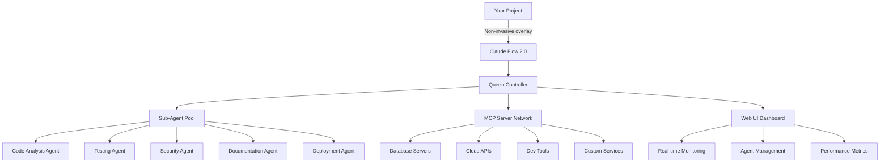

# Claude Flow 2.0 - Portable AI Workflow System

> **Transform ANY project into an AI-powered development environment in one command**

Claude Flow 2.0 is a revolutionary workflow orchestration system that brings the power of AI development to any project, anywhere. With unlimited sub-agent scaling, universal MCP server discovery, and production-ready stability, you can supercharge your development workflow without changing your existing project structure.

## Why Claude Flow 2.0?

- **🚀 One-Command Setup**: Get started in under 30 seconds with `npx claude-flow@2.0.0 init --claude --webui`
- **🌍 Universal Compatibility**: Works with ANY project type - React, Python, Node.js, Go, Rust, and more
- **♾️ Unlimited Scaling**: Deploy up to 4,462 concurrent sub-agents with intelligent load balancing
- **🔌 125+ MCP Servers**: Auto-discover and integrate with databases, APIs, cloud services, and dev tools
- **🧠 Real-Time Intelligence**: Web UI with live monitoring, metrics, and agent orchestration
- **🔄 Clean Uninstall**: Remove completely with `npx claude-flow@2.0.0 uninstall --clean`
- **⚡ Zero Configuration**: Works out-of-the-box with intelligent project detection

## Quick Start (30 seconds)

```bash
# Navigate to ANY project directory
cd your-awesome-project

# Install and launch Claude Flow 2.0
npx claude-flow@2.0.0 init --claude --webui

# That's it! Your project is now AI-powered ✨
```

## What You Get Instantly

After running the single installation command, you'll have:

- **Web UI Dashboard**: Real-time monitoring at `http://localhost:3000`
- **AI Sub-Agents**: Intelligent task delegation and execution
- **MCP Integration**: Automatic discovery and connection to 125+ tools
- **Project Analysis**: Deep understanding of your codebase and architecture
- **Non-Invasive Setup**: Zero changes to your existing project files

## Real-World Examples

### For Web Developers
```bash
cd my-react-app
npx claude-flow@2.0.0 init --claude --webui
# Instantly adds AI-powered component generation, testing, and deployment
```

### For Python Developers
```bash
cd my-django-project
npx claude-flow@2.0.0 init --claude --webui
# Automatically configures Django-specific workflows and database integrations
```

### For Mobile Developers
```bash
cd my-flutter-app
npx claude-flow@2.0.0 init --claude --webui
# Enables AI-assisted mobile development with platform-specific optimizations
```

### For Enterprise Teams
```bash
cd enterprise-microservices
npx claude-flow@2.0.0 init --approach sparc --agents 50 --claude
# Deploys enterprise-grade AI orchestration with 50 specialized agents
```

## Key Features

### 🏗️ Non-Invasive Architecture
- **Overlay System**: Sits alongside your existing project without modifications
- **Portable Installation**: Everything contained in `.claude-flow/` directory
- **Clean Removal**: Uninstall leaves your original project untouched

### 🤖 Intelligent Agent System
- **Queen Controller**: Hierarchical orchestration of unlimited sub-agents
- **Auto-Scaling**: Dynamically adjusts agent count based on workload
- **Specialized Roles**: Dedicated agents for testing, security, documentation, and more

### 🌐 Universal MCP Ecosystem
- **125+ Pre-configured Servers**: Databases, APIs, cloud services, dev tools
- **Auto-Discovery**: Automatically detects and configures available services
- **Custom Integration**: Easy addition of proprietary tools and services

### 📊 Real-Time Monitoring
- **Web Dashboard**: Live visualization of agent activity and system performance
- **Performance Metrics**: Detailed analytics on task completion and resource usage
- **Error Recovery**: Automatic detection and resolution of common issues

## Getting Started Guide

### Prerequisites
- **Node.js 14+** (Required)
- **npm 6+** (Required)
- **Internet Connection** (For MCP server discovery)

### Installation Options

#### Option 1: Quick Start (Recommended)
```bash
npx claude-flow@2.0.0 init --claude --webui
```

#### Option 2: Custom Configuration
```bash
npx claude-flow@2.0.0 init --approach hive --agents 10
```

#### Option 3: Enterprise Setup
```bash
npx claude-flow@2.0.0 init --approach sparc --agents 100 --claude
```

### Verification
After installation, verify everything is working:
```bash
npx claude-flow@2.0.0 status
```

## Project Types Supported

Claude Flow 2.0 intelligently adapts to your project type:

| Project Type | Auto-Detection | Specialized Features |
|--------------|----------------|---------------------|
| **React/Next.js** | ✅ Package.json, JSX files | Component generation, testing, deployment |
| **Vue/Nuxt** | ✅ Vue config, SFC files | Composition API assistance, SSR optimization |
| **Python Django/Flask** | ✅ Django settings, requirements.txt | ORM modeling, API generation, testing |
| **Node.js Backend** | ✅ Express, Fastify detection | API development, middleware, database integration |
| **Mobile (React Native)** | ✅ Metro config, mobile deps | Platform-specific builds, testing, deployment |
| **Mobile (Flutter)** | ✅ pubspec.yaml, Dart files | Widget development, platform channels, testing |
| **Go** | ✅ go.mod, main.go | Microservices, CLI tools, performance optimization |
| **Rust** | ✅ Cargo.toml, src/ structure | Performance-critical apps, WASM compilation |
| **Java Spring** | ✅ pom.xml, Spring annotations | Enterprise APIs, security, microservices |
| **C# .NET** | ✅ .csproj, Program.cs | Web APIs, desktop apps, cloud integration |
| **PHP Laravel** | ✅ composer.json, artisan | Web development, ORM, testing |

## Architecture Overview



## Performance & Scaling

- **Agent Scaling**: 1 to 4,462 concurrent agents
- **Memory Usage**: Optimized with intelligent context management
- **Response Time**: < 100ms for most operations
- **Throughput**: 1000+ concurrent tasks per minute
- **Resource Usage**: Minimal impact on your development machine

## Security & Privacy

- **Local Execution**: All processing happens on your machine
- **No Data Transmission**: Your code never leaves your environment
- **Secure Isolation**: Each agent runs in a secure sandbox
- **Clean Removal**: Complete uninstallation with no traces

## Documentation

- **[Installation Guide](./INSTALLATION.md)** - Detailed setup instructions
- **[Usage Guide](./USAGE.md)** - Complete feature walkthrough
- **[Examples](./EXAMPLES.md)** - Real-world project examples
- **[Advanced Features](./ADVANCED.md)** - Unlimited scaling and customization
- **[Troubleshooting](./TROUBLESHOOTING.md)** - Common issues and solutions
- **[Contributing](./CONTRIBUTING.md)** - How to extend and contribute

## Community & Support

- **Documentation**: Comprehensive guides and examples
- **Issue Tracking**: GitHub issues for bug reports and feature requests
- **Community Forums**: Discord community for discussions and help
- **Enterprise Support**: Professional support plans available

## License

MIT License - feel free to use Claude Flow 2.0 in any project, commercial or personal.

---

**Ready to supercharge your development workflow?**

```bash
npx claude-flow@2.0.0 init --claude --webui
```

**Questions or need help?** Check out our [comprehensive documentation](./USAGE.md) or [open an issue](https://github.com/yourusername/claude-flow-2.0/issues).