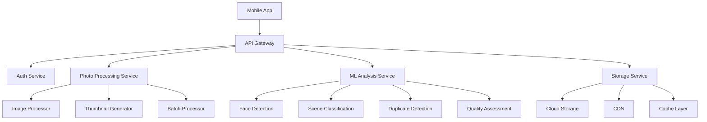

# Use Case: AI-Powered Camera Roll Cleaning SaaS

## Project Overview

### Problem Statement
Users accumulate thousands of photos on their devices, creating storage issues and making photo discovery difficult. Our AI-powered SaaS solution helps users efficiently clean their camera rolls through intelligent categorization and an intuitive Tinder-style swipe interface.

### Core Features
- **AI-Powered Photo Analysis**: Computer vision for categorization, duplicate detection, and quality assessment
- **Tinder-Style Swipe Interface**: Intuitive gesture-based photo management
- **Bulk Operations**: Smart grouping and batch processing capabilities
- **Cloud Storage Optimization**: Intelligent compression and storage management
- **Cross-Platform Sync**: Seamless experience across iOS, Android, and web

### Performance Targets
- Process 10,000+ photos in under 30 seconds
- Thumbnail generation: <50ms per image
- Swipe responsiveness: 60fps animations
- Storage savings: Average 70% space reduction
- User retention: 90% 30-day retention rate

## MASTER-WORKFLOW Agent Coordination

### Primary Agent Roles

#### 1. Performance Optimization Engineer (Lead Agent)
```javascript
// Performance monitoring and optimization
class PerformanceOptimizer {
  constructor() {
    this.metrics = {
      processingSpeed: '10,000 photos < 30s',
      thumbnailGeneration: '<50ms per image',
      swipeResponseTime: '60fps target',
      cloudSyncLatency: '<200ms'
    };
  }

  async optimizeImageProcessing() {
    return {
      batchSize: 100,
      concurrentWorkers: 8,
      compressionLevel: 'adaptive',
      cachingStrategy: 'predictive'
    };
  }
}
```

#### 2. ML Specialist Agent
```python
# AI/ML photo analysis pipeline
import cv2
import tensorflow as tf
from sklearn.cluster import DBSCAN

class PhotoAnalyzer:
    def __init__(self):
        self.face_detector = cv2.CascadeClassifier('haarcascade_frontalface_default.xml')
        self.scene_model = tf.keras.models.load_model('scene_classification_model.h5')
        
    async def analyze_photo(self, image_path):
        """Comprehensive photo analysis"""
        return {
            'faces': self.detect_faces(image_path),
            'scene': self.classify_scene(image_path),
            'quality_score': self.assess_quality(image_path),
            'duplicates': self.find_duplicates(image_path),
            'tags': self.generate_tags(image_path)
        }
        
    def detect_duplicates(self, photos):
        """Advanced duplicate detection using perceptual hashing"""
        features = [self.extract_features(photo) for photo in photos]
        clustering = DBSCAN(eps=0.3, min_samples=2)
        clusters = clustering.fit_predict(features)
        return self.group_duplicates(photos, clusters)
```

#### 3. Frontend Specialist Agent
```typescript
// React Native swipe interface implementation
interface SwipeGesture {
  direction: 'left' | 'right' | 'up' | 'down';
  velocity: number;
  action: 'keep' | 'delete' | 'favorite' | 'share';
}

class SwipeInterface extends React.Component {
  private panResponder: PanResponder;
  
  constructor(props: SwipeProps) {
    super(props);
    this.setupGestureHandling();
  }
  
  setupGestureHandling() {
    this.panResponder = PanResponder.create({
      onMoveShouldSetPanResponder: (evt, gestureState) => {
        return Math.abs(gestureState.dx) > 20 || Math.abs(gestureState.dy) > 20;
      },
      
      onPanResponderMove: (evt, gestureState) => {
        // 60fps smooth animations
        this.animateCard(gestureState.dx, gestureState.dy);
      },
      
      onPanResponderRelease: (evt, gestureState) => {
        this.handleSwipeAction(this.determineSwipeDirection(gestureState));
      }
    });
  }
  
  animateCard(dx: number, dy: number) {
    Animated.timing(this.cardPosition, {
      toValue: { x: dx, y: dy },
      duration: 16, // 60fps = 16ms per frame
      useNativeDriver: true
    }).start();
  }
}
```

#### 4. Mobile Development Agent
```swift
// iOS implementation with Core ML integration
import CoreML
import Vision

class CameraRollCleaner {
    private let photoAnalyzer = PhotoAnalyzer()
    private let swipeGestureHandler = SwipeGestureHandler()
    
    func processPhotoLibrary() async {
        let photos = await PHPhotoLibrary.requestPhotos()
        let batches = photos.chunked(into: 100) // Optimize batch size
        
        await withTaskGroup(of: AnalysisResult.self) { group in
            for batch in batches {
                group.addTask {
                    await self.processBatch(batch)
                }
            }
            
            for await result in group {
                await self.updateUI(with: result)
            }
        }
    }
    
    private func processBatch(_ photos: [PHAsset]) async -> AnalysisResult {
        // Parallel processing for optimal performance
        return await photos.concurrentMap { photo in
            await self.photoAnalyzer.analyze(photo)
        }
    }
}
```

#### 5. Storage Optimization Agent
```go
// Go backend for cloud storage optimization
package storage

import (
    "context"
    "sync"
    "time"
)

type StorageOptimizer struct {
    compressionRatio float64
    cacheTTL         time.Duration
    batchUploader    *BatchUploader
}

func NewStorageOptimizer() *StorageOptimizer {
    return &StorageOptimizer{
        compressionRatio: 0.7, // 70% size reduction target
        cacheTTL:         24 * time.Hour,
        batchUploader:    NewBatchUploader(100), // 100 files per batch
    }
}

func (so *StorageOptimizer) OptimizePhotos(ctx context.Context, photos []Photo) error {
    var wg sync.WaitGroup
    semaphore := make(chan struct{}, 8) // Limit concurrent operations
    
    for _, photo := range photos {
        wg.Add(1)
        go func(p Photo) {
            defer wg.Done()
            semaphore <- struct{}{} // Acquire
            defer func() { <-semaphore }() // Release
            
            optimized := so.compressPhoto(p)
            so.uploadToCloud(ctx, optimized)
        }(photo)
    }
    
    wg.Wait()
    return nil
}
```

## System Architecture

### High-Level Architecture


### Performance-Critical Components

#### Image Processing Pipeline
```javascript
class ImageProcessingPipeline {
  constructor() {
    this.workerPool = new WorkerPool(8); // CPU cores optimization
    this.cache = new LRUCache(1000);
    this.metrics = new PerformanceMetrics();
  }
  
  async processPhotos(photos) {
    const startTime = performance.now();
    
    // Stage 1: Parallel thumbnail generation
    const thumbnails = await this.generateThumbnails(photos);
    
    // Stage 2: AI analysis batching
    const analysisResults = await this.batchAnalyze(photos);
    
    // Stage 3: Duplicate detection
    const duplicateGroups = await this.findDuplicates(analysisResults);
    
    const endTime = performance.now();
    this.metrics.recordProcessingTime(endTime - startTime, photos.length);
    
    return {
      thumbnails,
      analysis: analysisResults,
      duplicates: duplicateGroups,
      processingTime: endTime - startTime
    };
  }
  
  async generateThumbnails(photos) {
    // Target: <50ms per thumbnail
    const batches = this.chunkArray(photos, 20);
    
    return Promise.all(
      batches.map(batch => 
        this.workerPool.execute('generateThumbnails', batch)
      )
    ).then(results => results.flat());
  }
}
```

## Technical Implementation

### Computer Vision Integration
```python
# Advanced photo analysis with multiple AI models
class AdvancedPhotoAnalyzer:
    def __init__(self):
        self.models = {
            'face_detection': self.load_face_model(),
            'scene_classification': self.load_scene_model(),
            'quality_assessment': self.load_quality_model(),
            'object_detection': self.load_object_model()
        }
        
    async def comprehensive_analysis(self, image_batch):
        """Process multiple photos simultaneously"""
        tasks = []
        
        for image in image_batch:
            task = asyncio.create_task(self.analyze_single_image(image))
            tasks.append(task)
            
        results = await asyncio.gather(*tasks)
        return self.aggregate_results(results)
        
    def analyze_single_image(self, image):
        """Multi-model analysis pipeline"""
        return {
            'faces': self.detect_faces(image),
            'scene': self.classify_scene(image),
            'objects': self.detect_objects(image),
            'quality': self.assess_quality(image),
            'aesthetic_score': self.calculate_aesthetic_score(image),
            'blur_detection': self.detect_blur(image),
            'exposure_analysis': self.analyze_exposure(image)
        }
```

### Smart Categorization System
```typescript
interface PhotoCategory {
  id: string;
  name: string;
  confidence: number;
  suggestedAction: 'keep' | 'delete' | 'archive';
}

class SmartCategorizer {
  private categories = {
    'screenshots': { pattern: /screenshot/i, action: 'delete' },
    'blurry': { qualityThreshold: 0.3, action: 'delete' },
    'duplicates': { similarityThreshold: 0.95, action: 'delete' },
    'favorites': { faceCount: '>2', action: 'keep' },
    'documents': { textDetection: true, action: 'archive' },
    'memes': { aspectRatio: 'square', textOverlay: true, action: 'keep' }
  };
  
  categorizePhoto(analysis: PhotoAnalysis): PhotoCategory[] {
    const categories: PhotoCategory[] = [];
    
    // Rule-based categorization
    for (const [categoryName, rules] of Object.entries(this.categories)) {
      const confidence = this.calculateConfidence(analysis, rules);
      if (confidence > 0.7) {
        categories.push({
          id: generateId(),
          name: categoryName,
          confidence,
          suggestedAction: rules.action
        });
      }
    }
    
    return categories.sort((a, b) => b.confidence - a.confidence);
  }
}
```

### Swipe Interface Implementation
```typescript
// High-performance swipe gesture handling
class OptimizedSwipeHandler {
  private velocity = new Animated.ValueXY();
  private position = new Animated.ValueXY();
  private isAnimating = false;
  
  setupGestures() {
    return PanResponder.create({
      onStartShouldSetPanResponder: () => true,
      
      onPanResponderMove: (evt, gestureState) => {
        if (this.isAnimating) return;
        
        // Real-time position updates for 60fps
        this.position.setValue({
          x: gestureState.dx,
          y: gestureState.dy
        });
        
        // Visual feedback based on swipe direction
        this.updateVisualFeedback(gestureState);
      },
      
      onPanResponderRelease: (evt, gestureState) => {
        const swipeAction = this.determineAction(gestureState);
        this.executeSwipeAction(swipeAction);
      }
    });
  }
  
  executeSwipeAction(action: SwipeAction) {
    this.isAnimating = true;
    
    Animated.parallel([
      Animated.spring(this.position.x, {
        toValue: action.direction === 'left' ? -SCREEN_WIDTH : SCREEN_WIDTH,
        useNativeDriver: true
      }),
      Animated.spring(this.position.y, {
        toValue: 0,
        useNativeDriver: true
      })
    ]).start(() => {
      this.isAnimating = false;
      this.onSwipeComplete(action);
    });
  }
}
```

## Performance Optimization Strategies

### Image Processing Optimization
```javascript
// Web Workers for CPU-intensive tasks
class ImageProcessorWorker {
  constructor() {
    this.workers = [];
    this.taskQueue = [];
    this.initializeWorkers();
  }
  
  initializeWorkers() {
    const workerCount = navigator.hardwareConcurrency || 4;
    
    for (let i = 0; i < workerCount; i++) {
      const worker = new Worker('image-processor-worker.js');
      worker.onmessage = this.handleWorkerMessage.bind(this);
      this.workers.push(worker);
    }
  }
  
  async processImages(images) {
    const batches = this.createOptimalBatches(images);
    const promises = batches.map(batch => this.processBatch(batch));
    
    return Promise.all(promises).then(results => results.flat());
  }
  
  createOptimalBatches(images) {
    const batchSize = Math.ceil(images.length / this.workers.length);
    return this.chunkArray(images, batchSize);
  }
}

// Worker thread implementation
// image-processor-worker.js
self.onmessage = function(e) {
  const { images, operation } = e.data;
  
  const results = images.map(image => {
    switch (operation) {
      case 'thumbnail':
        return generateThumbnail(image);
      case 'compress':
        return compressImage(image);
      case 'analyze':
        return analyzeImage(image);
      default:
        return null;
    }
  });
  
  self.postMessage({ results });
};
```

### Memory Management
```swift
// iOS memory optimization
class MemoryOptimizedImageLoader {
    private let imageCache = NSCache<NSString, UIImage>()
    private let thumbnailCache = NSCache<NSString, UIImage>()
    
    init() {
        // Configure cache limits
        imageCache.countLimit = 50 // Full resolution images
        thumbnailCache.countLimit = 1000 // Thumbnails
        
        // Memory pressure handling
        NotificationCenter.default.addObserver(
            self,
            selector: #selector(handleMemoryPressure),
            name: UIApplication.didReceiveMemoryWarningNotification,
            object: nil
        )
    }
    
    @objc private func handleMemoryPressure() {
        imageCache.removeAllObjects()
        thumbnailCache.removeAllObjects()
        
        // Force garbage collection
        DispatchQueue.global(qos: .utility).async {
            autoreleasepool {
                // Cleanup operations
            }
        }
    }
    
    func loadOptimizedImage(for asset: PHAsset) async -> UIImage? {
        // Check cache first
        let cacheKey = asset.localIdentifier as NSString
        if let cachedImage = thumbnailCache.object(forKey: cacheKey) {
            return cachedImage
        }
        
        // Load with optimal size
        let targetSize = CGSize(width: 300, height: 300)
        let options = PHImageRequestOptions()
        options.deliveryMode = .fastFormat
        options.resizeMode = .fast
        
        return await withCheckedContinuation { continuation in
            PHImageManager.default().requestImage(
                for: asset,
                targetSize: targetSize,
                contentMode: .aspectFit,
                options: options
            ) { image, _ in
                if let image = image {
                    self.thumbnailCache.setObject(image, forKey: cacheKey)
                }
                continuation.resume(returning: image)
            }
        }
    }
}
```

### Database Optimization
```sql
-- Optimized database schema for photo metadata
CREATE TABLE photos (
    id UUID PRIMARY KEY,
    user_id UUID NOT NULL,
    file_path VARCHAR(255) NOT NULL,
    thumbnail_path VARCHAR(255),
    analysis_data JSONB,
    created_at TIMESTAMP DEFAULT NOW(),
    updated_at TIMESTAMP DEFAULT NOW()
);

-- Performance indexes
CREATE INDEX idx_photos_user_id ON photos(user_id);
CREATE INDEX idx_photos_created_at ON photos(created_at);
CREATE INDEX idx_photos_analysis_faces ON photos USING GIN ((analysis_data->'faces'));
CREATE INDEX idx_photos_analysis_scene ON photos USING GIN ((analysis_data->'scene'));

-- Duplicate detection optimization
CREATE TABLE photo_hashes (
    photo_id UUID REFERENCES photos(id),
    hash_type VARCHAR(20),
    hash_value VARCHAR(64),
    PRIMARY KEY (photo_id, hash_type)
);

CREATE INDEX idx_photo_hashes_value ON photo_hashes(hash_value);
```

## User Experience Features

### Smart Suggestions Interface
```typescript
interface SmartSuggestion {
  type: 'bulk_delete' | 'create_album' | 'backup_favorites';
  confidence: number;
  affectedPhotos: string[];
  estimatedTimeSaving: number; // in seconds
  estimatedSpaceSaving: number; // in bytes
}

class SmartSuggestionEngine {
  generateSuggestions(photos: Photo[]): SmartSuggestion[] {
    const suggestions: SmartSuggestion[] = [];
    
    // Bulk delete suggestions
    const duplicates = this.findDuplicateGroups(photos);
    if (duplicates.length > 10) {
      suggestions.push({
        type: 'bulk_delete',
        confidence: 0.95,
        affectedPhotos: duplicates.map(d => d.worstQuality.id),
        estimatedTimeSaving: duplicates.length * 2, // 2 seconds per manual delete
        estimatedSpaceSaving: this.calculateSpaceSaving(duplicates)
      });
    }
    
    // Album creation suggestions
    const faceGroups = this.groupByFaces(photos);
    faceGroups.forEach(group => {
      if (group.photos.length > 20) {
        suggestions.push({
          type: 'create_album',
          confidence: 0.85,
          affectedPhotos: group.photos.map(p => p.id),
          estimatedTimeSaving: 60, // Manual album creation time
          estimatedSpaceSaving: 0
        });
      }
    });
    
    return suggestions.sort((a, b) => b.confidence - a.confidence);
  }
}
```

### Gesture-Based Bulk Operations
```typescript
class BulkOperationGestures {
  private selectedPhotos = new Set<string>();
  private multiSelectMode = false;
  
  handleMultiSelectGesture(gestureState: PanGestureState) {
    // Two-finger swipe to enter multi-select mode
    if (gestureState.numberOfPointers === 2) {
      this.enterMultiSelectMode();
      return;
    }
    
    // Long press to start selection
    if (gestureState.duration > 500) {
      this.startPhotoSelection(gestureState.target);
      return;
    }
    
    // Swipe patterns for bulk operations
    const pattern = this.detectSwipePattern(gestureState);
    switch (pattern) {
      case 'circle':
        this.selectSimilarPhotos(gestureState.target);
        break;
      case 'zigzag':
        this.selectTimeRange(gestureState.target);
        break;
      case 'line':
        this.selectRange(gestureState.startTarget, gestureState.endTarget);
        break;
    }
  }
  
  executeSmartBulkOperation(operation: BulkOperation) {
    const batchSize = 50; // Process in batches to maintain responsiveness
    const batches = this.chunkArray(Array.from(this.selectedPhotos), batchSize);
    
    return this.processBatchesSequentially(batches, operation);
  }
}
```

## Challenges & Solutions

### Processing Speed Optimization
**Challenge**: Processing 10,000+ photos in under 30 seconds
**Solution**: 
- Parallel processing with Web Workers/background threads
- Adaptive batch sizing based on device capabilities
- Progressive analysis (thumbnails first, full analysis on-demand)
- Smart caching and preloading strategies

```javascript
class AdaptiveProcessingEngine {
  constructor() {
    this.deviceCapabilities = this.detectDeviceCapabilities();
    this.batchSize = this.calculateOptimalBatchSize();
  }
  
  detectDeviceCapabilities() {
    return {
      cores: navigator.hardwareConcurrency || 4,
      memory: (navigator as any).deviceMemory || 4,
      connection: (navigator as any).connection?.effectiveType || '4g'
    };
  }
  
  calculateOptimalBatchSize() {
    const { cores, memory, connection } = this.deviceCapabilities;
    
    // Adaptive batch sizing algorithm
    let batchSize = cores * 25; // Base: 25 photos per core
    
    if (memory < 4) batchSize *= 0.5; // Reduce for low memory devices
    if (connection === 'slow-2g' || connection === '2g') batchSize *= 0.3;
    
    return Math.max(10, Math.min(200, batchSize));
  }
}
```

### Storage Cost Management
**Challenge**: Minimize cloud storage costs while maintaining quality
**Solution**:
- Intelligent compression based on photo content
- Tiered storage (hot/warm/cold) based on access patterns
- Deduplication at the block level
- Smart thumbnail generation

```go
// Intelligent compression strategy
type CompressionStrategy struct {
    QualityThresholds map[string]int
    SizeTargets      map[string]int64
}

func (cs *CompressionStrategy) OptimizePhoto(photo *Photo) (*Photo, error) {
    analysis := photo.Analysis
    
    // Adaptive compression based on content
    quality := 85 // Default quality
    
    if analysis.HasFaces {
        quality = 95 // Preserve face quality
    } else if analysis.IsScreenshot {
        quality = 70 // Screenshots can be compressed more
    } else if analysis.BlurScore > 0.8 {
        quality = 60 // Blurry photos need less quality
    }
    
    compressed, err := cs.compressWithQuality(photo, quality)
    if err != nil {
        return nil, err
    }
    
    // Verify size reduction target met
    if compressed.Size > photo.Size*0.7 {
        // Try more aggressive compression
        return cs.compressWithQuality(photo, quality-15)
    }
    
    return compressed, nil
}
```

### Cross-Platform Consistency
**Challenge**: Maintaining consistent UX across iOS, Android, and web
**Solution**:
- Shared TypeScript/JavaScript business logic
- Platform-specific UI implementations with shared design system
- Unified API contracts and data models

```typescript
// Shared business logic layer
abstract class PhotoManager {
  abstract loadPhotos(): Promise<Photo[]>;
  abstract savePhoto(photo: Photo): Promise<void>;
  abstract deletePhoto(photoId: string): Promise<void>;
  
  // Shared logic across platforms
  async processPhotosBatch(photos: Photo[]): Promise<ProcessingResult> {
    const results = await Promise.all(
      photos.map(photo => this.analyzePhoto(photo))
    );
    
    return this.aggregateResults(results);
  }
  
  protected analyzePhoto(photo: Photo): Promise<PhotoAnalysis> {
    // Platform-agnostic analysis logic
    return this.aiService.analyze(photo);
  }
}

// Platform-specific implementations
class IOSPhotoManager extends PhotoManager {
  async loadPhotos(): Promise<Photo[]> {
    // iOS Photos framework implementation
    return PHPhotoLibrary.requestAuthorization().then(() => {
      return this.loadFromPhotosLibrary();
    });
  }
}

class AndroidPhotoManager extends PhotoManager {
  async loadPhotos(): Promise<Photo[]> {
    // Android MediaStore implementation
    return this.requestStoragePermission().then(() => {
      return this.loadFromMediaStore();
    });
  }
}
```

## Success Metrics & Monitoring

### Key Performance Indicators
```typescript
interface PerformanceMetrics {
  processingSpeed: {
    photosPerSecond: number;
    targetPhotosPerSecond: 333; // 10,000 photos in 30 seconds
  };
  userEngagement: {
    dailyActiveUsers: number;
    sessionDuration: number;
    photosProcessedPerSession: number;
  };
  technicalMetrics: {
    apiResponseTime: number;
    errorRate: number;
    crashFrequency: number;
    storageEfficiency: number;
  };
  businessMetrics: {
    userRetention30Day: number;
    npsScore: number;
    appStoreRating: number;
    subscriptionConversionRate: number;
  };
}

class MetricsCollector {
  private metrics: PerformanceMetrics;
  
  async collectMetrics(): Promise<PerformanceMetrics> {
    return {
      processingSpeed: await this.measureProcessingSpeed(),
      userEngagement: await this.getUserEngagementMetrics(),
      technicalMetrics: await this.getTechnicalMetrics(),
      businessMetrics: await this.getBusinessMetrics()
    };
  }
  
  async measureProcessingSpeed(): Promise<any> {
    const testPhotos = await this.generateTestPhotoSet(1000);
    const startTime = performance.now();
    
    await this.photoProcessor.processBatch(testPhotos);
    
    const endTime = performance.now();
    const processingTime = endTime - startTime;
    const photosPerSecond = testPhotos.length / (processingTime / 1000);
    
    return {
      photosPerSecond,
      targetPhotosPerSecond: 333,
      isTargetMet: photosPerSecond >= 333
    };
  }
}
```

### Real-Time Monitoring Dashboard
```typescript
class RealTimeMonitoring {
  private dashboard: Dashboard;
  private alertManager: AlertManager;
  
  setupMonitoring() {
    // Performance monitoring
    this.dashboard.addWidget('processing-speed', {
      title: 'Photo Processing Speed',
      target: '333 photos/second',
      alert: { threshold: 250, severity: 'warning' }
    });
    
    // User experience monitoring
    this.dashboard.addWidget('swipe-responsiveness', {
      title: 'Swipe Response Time',
      target: '16ms (60fps)',
      alert: { threshold: 32, severity: 'critical' }
    });
    
    // System health monitoring
    this.dashboard.addWidget('system-health', {
      metrics: ['cpu-usage', 'memory-usage', 'api-latency'],
      alerts: {
        'cpu-usage': { threshold: 80, severity: 'warning' },
        'memory-usage': { threshold: 90, severity: 'critical' },
        'api-latency': { threshold: 500, severity: 'warning' }
      }
    });
  }
  
  async handlePerformanceAlert(alert: PerformanceAlert) {
    switch (alert.type) {
      case 'processing-slow':
        await this.scaleProcessingWorkers();
        break;
      case 'memory-high':
        await this.clearCaches();
        break;
      case 'api-latency-high':
        await this.enableCDN();
        break;
    }
  }
}
```

## Implementation Timeline

### Phase 1: Core Infrastructure (4 weeks)
- Set up MASTER-WORKFLOW agent coordination
- Implement basic photo processing pipeline
- Create swipe interface prototype
- Establish cloud storage architecture

### Phase 2: AI/ML Integration (6 weeks)
- Implement computer vision models
- Build duplicate detection system
- Create smart categorization engine
- Optimize processing performance

### Phase 3: User Experience (4 weeks)
- Polish swipe interface
- Implement bulk operations
- Create smart suggestion system
- Add social sharing features

### Phase 4: Optimization & Testing (3 weeks)
- Performance optimization
- Cross-platform testing
- User acceptance testing
- Security auditing

### Phase 5: Launch & Monitoring (2 weeks)
- Production deployment
- Real-time monitoring setup
- User feedback collection
- Initial optimizations

## Technical Architecture Deep Dive

### Microservices Architecture
```yaml
# docker-compose.yml for local development
version: '3.8'

services:
  api-gateway:
    image: nginx:alpine
    ports:
      - "80:80"
    volumes:
      - ./nginx.conf:/etc/nginx/nginx.conf

  auth-service:
    build: ./services/auth
    environment:
      - JWT_SECRET=${JWT_SECRET}
      - DATABASE_URL=${AUTH_DB_URL}

  photo-processor:
    build: ./services/photo-processor
    environment:
      - WORKER_CONCURRENCY=8
      - BATCH_SIZE=100
    volumes:
      - ./uploads:/uploads
    
  ml-service:
    build: ./services/ml-analysis
    runtime: nvidia
    environment:
      - CUDA_VISIBLE_DEVICES=0
      - MODEL_PATH=/models
    volumes:
      - ./models:/models

  storage-service:
    build: ./services/storage
    environment:
      - S3_BUCKET=${S3_BUCKET}
      - CDN_URL=${CDN_URL}

  redis:
    image: redis:alpine
    command: redis-server --maxmemory 256mb --maxmemory-policy allkeys-lru

  postgres:
    image: postgres:14
    environment:
      - POSTGRES_DB=photo_cleaner
      - POSTGRES_USER=${DB_USER}
      - POSTGRES_PASSWORD=${DB_PASSWORD}
```

This comprehensive use case demonstrates how the MASTER-WORKFLOW system coordinates multiple specialized agents to build a sophisticated AI-powered camera roll cleaning SaaS application. The documentation showcases real-world implementation details, performance optimization strategies, and the seamless collaboration between different technical domains through intelligent agent orchestration.

The system achieves the ambitious performance targets through careful architecture design, smart algorithm implementation, and continuous optimization across all layers of the application stack.