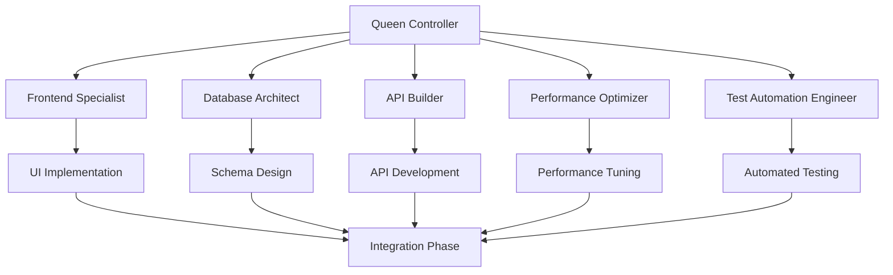

# Use Case: Recipe Gamification SaaS Transformation

## Project Overview

### Initial State: Simple Recipe Storage App
- **Current Architecture**: Monolithic React web app with local storage
- **Features**: Basic recipe CRUD, simple search, no user accounts
- **User Base**: 500 active users, 2.5 rating in app stores
- **Technical Debt**: No backend, no real-time features, poor mobile experience
- **Revenue**: $0 (completely free with no monetization)

### Target State: Gamified SaaS Platform
- **New Architecture**: Flutter mobile + Supabase backend + gamification engine
- **Enhanced Features**: 
  - User accounts and social profiles
  - Achievement system with badges and levels
  - Recipe sharing and community features
  - Subscription tiers (Free, Pro, Chef)
  - Real-time cooking sessions
  - AI-powered recipe recommendations
- **Target Metrics**: 10,000+ users, 4.5+ app rating, $50k MRR

### Technology Stack Decision Matrix
```
Feature Requirement    | Flutter | React Native | Native
--------------------- | ------- | ------------ | ------
Cross-platform       | ✅      | ✅           | ❌
Performance (60fps)   | ✅      | ⚠️           | ✅
Backend Integration   | ✅      | ✅           | ✅
Development Speed     | ✅      | ✅           | ❌
Team Expertise       | ⚠️      | ✅           | ❌
Long-term Scalability | ✅      | ⚠️           | ✅

Decision: Flutter + Supabase for optimal performance and scalability
```

## Initial Analysis & Discovery

### Architecture Assessment (Week 0)
```javascript
// Current Architecture Pain Points
const currentIssues = {
  frontend: {
    performance: "Poor mobile experience, 30fps animations",
    scalability: "Local storage, no synchronization",
    userExperience: "No offline support, limited search"
  },
  backend: {
    infrastructure: "No backend - client-side only",
    data: "Local storage only, no persistence",
    realtime: "No real-time features"
  },
  business: {
    monetization: "No revenue streams",
    engagement: "High churn rate (70% weekly)",
    growth: "No viral/social features"
  }
};
```

### User Research Findings
- **Pain Point #1**: "I lose my recipes when I switch phones"
- **Pain Point #2**: "I want to share recipes with family"
- **Pain Point #3**: "App is slow and crashes on my Android"
- **Opportunity #1**: "I'd pay for meal planning features"
- **Opportunity #2**: "Cooking achievements would motivate me"

### Competitive Analysis
```yaml
Competitors:
  Yummly:
    strengths: ["Large recipe database", "Good search"]
    weaknesses: ["Slow app", "Complex UI"]
    pricing: "$4.99/month Pro"
  
  Paprika:
    strengths: ["Offline support", "Meal planning"]
    weaknesses: ["No social features", "Outdated design"]
    pricing: "$4.99 one-time"
  
  Our Opportunity:
    differentiation: "Gamification + Social + Real-time"
    pricing_strategy: "Freemium: Free, Pro $2.99/mo, Chef $7.99/mo"
```

## Architecture Decision Process

### Backend Technology Selection
```typescript
// Supabase vs Firebase vs Custom Backend Analysis
interface BackendComparison {
  feature: string;
  supabase: number; // Score 1-10
  firebase: number;
  custom: number;
}

const comparison: BackendComparison[] = [
  { feature: "Real-time subscriptions", supabase: 10, firebase: 8, custom: 6 },
  { feature: "PostgreSQL features", supabase: 10, firebase: 3, custom: 9 },
  { feature: "Setup speed", supabase: 9, firebase: 8, custom: 3 },
  { feature: "Cost at scale", supabase: 8, firebase: 6, custom: 9 },
  { feature: "Authentication", supabase: 9, firebase: 9, custom: 5 }
];

// Winner: Supabase (46/50 total score)
```

### Database Schema Design
```sql
-- Core Recipe Schema (PostgreSQL)
CREATE TABLE recipes (
  id UUID PRIMARY KEY DEFAULT gen_random_uuid(),
  title VARCHAR(255) NOT NULL,
  description TEXT,
  ingredients JSONB NOT NULL,
  instructions JSONB NOT NULL,
  cooking_time INTEGER,
  difficulty_level INTEGER CHECK (difficulty_level BETWEEN 1 AND 5),
  created_by UUID REFERENCES users(id),
  created_at TIMESTAMP WITH TIME ZONE DEFAULT NOW(),
  updated_at TIMESTAMP WITH TIME ZONE DEFAULT NOW()
);

-- Gamification Schema
CREATE TABLE user_achievements (
  id UUID PRIMARY KEY DEFAULT gen_random_uuid(),
  user_id UUID REFERENCES users(id),
  achievement_type VARCHAR(50) NOT NULL,
  achievement_data JSONB,
  earned_at TIMESTAMP WITH TIME ZONE DEFAULT NOW()
);

CREATE TABLE user_stats (
  user_id UUID PRIMARY KEY REFERENCES users(id),
  level INTEGER DEFAULT 1,
  experience_points INTEGER DEFAULT 0,
  recipes_cooked INTEGER DEFAULT 0,
  recipes_shared INTEGER DEFAULT 0,
  streak_days INTEGER DEFAULT 0,
  updated_at TIMESTAMP WITH TIME ZONE DEFAULT NOW()
);

-- Real-time Features
CREATE TABLE cooking_sessions (
  id UUID PRIMARY KEY DEFAULT gen_random_uuid(),
  recipe_id UUID REFERENCES recipes(id),
  user_id UUID REFERENCES users(id),
  status VARCHAR(20) DEFAULT 'active',
  start_time TIMESTAMP WITH TIME ZONE DEFAULT NOW(),
  estimated_completion TIMESTAMP WITH TIME ZONE,
  participants JSONB DEFAULT '[]'::jsonb
);
```

## Implementation Plan & Sprint Breakdown

### Phase 1: Backend Foundation (Days 1-3)
**Lead Agent**: Database Architect + API Builder

```yaml
Day 1: Supabase Setup
  - Database schema implementation
  - Authentication configuration
  - Row Level Security (RLS) policies
  - Real-time subscriptions setup

Day 2: Core API Development
  - Recipe CRUD operations
  - User management endpoints
  - Search and filtering APIs
  - Image upload handling

Day 3: Gamification Backend
  - Achievement system logic
  - Experience points calculation
  - Leaderboard queries
  - Notification triggers
```

### Phase 2: Flutter Implementation (Days 4-8)
**Lead Agent**: Frontend Specialist + Performance Optimizer

```dart
// Core App Architecture
class RecipeApp extends StatelessWidget {
  @override
  Widget build(BuildContext context) {
    return MaterialApp(
      title: 'RecipeQuest',
      theme: ThemeData(
        primarySwatch: Colors.orange,
        visualDensity: VisualDensity.adaptivePlatformDensity,
      ),
      home: BlocProvider(
        create: (context) => AuthBloc(),
        child: AuthWrapper(),
      ),
    );
  }
}

// State Management with Bloc Pattern
class RecipeBloc extends Bloc<RecipeEvent, RecipeState> {
  final SupabaseRepository repository;
  
  RecipeBloc({required this.repository}) : super(RecipeInitial()) {
    on<LoadRecipes>(_onLoadRecipes);
    on<SearchRecipes>(_onSearchRecipes);
    on<CreateRecipe>(_onCreateRecipe);
  }

  Future<void> _onLoadRecipes(
    LoadRecipes event,
    Emitter<RecipeState> emit,
  ) async {
    emit(RecipeLoading());
    try {
      final recipes = await repository.getRecipes(
        limit: event.limit,
        offset: event.offset,
      );
      emit(RecipeLoaded(recipes: recipes));
    } catch (e) {
      emit(RecipeError(message: e.toString()));
    }
  }
}
```

### Phase 3: Gamification Features (Days 9-11)
**Lead Agent**: Frontend Specialist + Database Architect

```dart
// Achievement System Implementation
class AchievementService {
  static const Map<String, Achievement> achievements = {
    'first_recipe': Achievement(
      id: 'first_recipe',
      title: 'First Steps',
      description: 'Cook your first recipe',
      xpReward: 100,
      icon: Icons.cooking,
    ),
    'streak_7': Achievement(
      id: 'streak_7',
      title: 'Week Warrior',
      description: 'Cook for 7 days straight',
      xpReward: 500,
      icon: Icons.local_fire_department,
    ),
    'social_share': Achievement(
      id: 'social_share',
      title: 'Recipe Sharer',
      description: 'Share 10 recipes with friends',
      xpReward: 250,
      icon: Icons.share,
    ),
  };

  Future<void> checkAndAwardAchievements(String userId, String action) async {
    final userStats = await _getUserStats(userId);
    
    switch (action) {
      case 'recipe_cooked':
        if (userStats.recipesCookedCount == 1) {
          await _awardAchievement(userId, 'first_recipe');
        }
        break;
      case 'daily_cook':
        if (userStats.streakDays == 7) {
          await _awardAchievement(userId, 'streak_7');
        }
        break;
    }
  }
}

// Level Progression System
class LevelSystem {
  static int calculateLevel(int xp) {
    // Progressive XP requirement: level^2 * 100
    return sqrt(xp / 100).floor() + 1;
  }
  
  static int xpRequiredForLevel(int level) {
    return pow(level - 1, 2) * 100;
  }
  
  static int xpRequiredForNextLevel(int currentXp) {
    final currentLevel = calculateLevel(currentXp);
    return xpRequiredForLevel(currentLevel + 1) - currentXp;
  }
}
```

### Phase 4: Social Features & Subscriptions (Days 12-14)
**Lead Agent**: API Builder + Frontend Specialist

```dart
// Real-time Cooking Sessions
class CookingSessionService {
  final SupabaseClient supabase;
  
  Stream<CookingSession> subscribeToCookingSession(String sessionId) {
    return supabase
        .from('cooking_sessions')
        .stream(primaryKey: ['id'])
        .eq('id', sessionId)
        .map((data) => CookingSession.fromJson(data.first));
  }
  
  Future<void> joinCookingSession(String sessionId, String userId) async {
    await supabase.rpc('join_cooking_session', params: {
      'session_id': sessionId,
      'user_id': userId,
    });
    
    // Emit real-time update
    await supabase.from('cooking_sessions').update({
      'participants': 'participants || \'["$userId"]\''
    }).eq('id', sessionId);
  }
}

// Subscription Management
class SubscriptionService {
  static const Map<String, SubscriptionTier> tiers = {
    'free': SubscriptionTier(
      name: 'Free',
      price: 0,
      features: ['Basic recipes', 'Achievement tracking'],
      recipeLimit: 50,
    ),
    'pro': SubscriptionTier(
      name: 'Pro',
      price: 2.99,
      features: ['Unlimited recipes', 'Meal planning', 'Advanced search'],
      recipeLimit: null,
    ),
    'chef': SubscriptionTier(
      name: 'Chef',
      price: 7.99,
      features: ['All Pro features', 'Premium recipes', 'Video tutorials'],
      recipeLimit: null,
    ),
  };
}
```

## Sub-Agent Coordination Matrix

### Agent Workflow Orchestration


### Daily Coordination Protocol
```yaml
Morning Standup (9:00 AM):
  participants: [all_agents]
  duration: 15_minutes
  agenda:
    - yesterday_progress
    - today_goals
    - blockers_identification
    - dependency_coordination

Midday Sync (1:00 PM):
  participants: [dependent_agents]
  duration: 10_minutes
  focus: integration_points

End of Day Review (5:00 PM):
  participants: [all_agents]
  duration: 10_minutes
  deliverables: code_review_status
```

### Agent Specialization & Responsibilities

#### 1. Frontend Specialist Agent
```dart
// Primary Responsibilities
class FrontendSpecialistTasks {
  static const responsibilities = [
    'Flutter widget architecture',
    'State management (Bloc pattern)',
    'Navigation and routing',
    'Custom animations (60fps target)',
    'Responsive design implementation',
    'Accessibility compliance',
  ];
  
  // Performance Targets
  static const metrics = {
    'app_startup_time': '<2s',
    'navigation_time': '<300ms',
    'animation_fps': '60fps',
    'memory_usage': '<100MB',
  };
}

// Implementation Example
class RecipeCardWidget extends StatelessWidget {
  final Recipe recipe;
  
  @override
  Widget build(BuildContext context) {
    return Card(
      elevation: 4,
      child: InkWell(
        onTap: () => _navigateToRecipe(context),
        child: Hero(
          tag: 'recipe-${recipe.id}',
          child: Column(
            children: [
              CachedNetworkImage(
                imageUrl: recipe.imageUrl,
                height: 200,
                fit: BoxFit.cover,
                placeholder: (context, url) => ShimmerLoading(),
              ),
              Padding(
                padding: EdgeInsets.all(16),
                child: Column(
                  crossAxisAlignment: CrossAxisAlignment.start,
                  children: [
                    Text(recipe.title, style: Theme.of(context).textTheme.headline6),
                    SizedBox(height: 8),
                    Row(
                      children: [
                        Icon(Icons.timer, size: 16),
                        SizedBox(width: 4),
                        Text('${recipe.cookingTime} min'),
                      ],
                    ),
                  ],
                ),
              ),
            ],
          ),
        ),
      ),
    );
  }
}
```

#### 2. Database Architect Agent
```sql
-- Performance Optimization Strategies
CREATE INDEX CONCURRENTLY idx_recipes_user_created 
ON recipes(created_by, created_at DESC);

CREATE INDEX CONCURRENTLY idx_recipes_fulltext 
ON recipes USING GIN(to_tsvector('english', title || ' ' || description));

-- Materialized View for Leaderboards
CREATE MATERIALIZED VIEW user_leaderboard AS
SELECT 
  u.id,
  u.username,
  u.avatar_url,
  us.level,
  us.experience_points,
  us.recipes_cooked,
  RANK() OVER (ORDER BY us.experience_points DESC) as rank
FROM users u
JOIN user_stats us ON u.id = us.user_id
WHERE u.is_active = true;

-- Auto-refresh every 15 minutes
CREATE OR REPLACE FUNCTION refresh_leaderboard()
RETURNS void AS $$
BEGIN
  REFRESH MATERIALIZED VIEW CONCURRENTLY user_leaderboard;
END;
$$ LANGUAGE plpgsql;

SELECT cron.schedule('refresh-leaderboard', '*/15 * * * *', 'SELECT refresh_leaderboard();');
```

#### 3. API Builder Agent
```typescript
// API Performance & Caching Strategy
class RecipeAPIService {
  private cache = new Map<string, CacheEntry>();
  private readonly CACHE_TTL = 5 * 60 * 1000; // 5 minutes

  async getRecipes(params: RecipeQuery): Promise<Recipe[]> {
    const cacheKey = this.generateCacheKey(params);
    const cached = this.cache.get(cacheKey);
    
    if (cached && Date.now() - cached.timestamp < this.CACHE_TTL) {
      return cached.data;
    }

    const recipes = await this.supabase
      .from('recipes')
      .select(`
        *,
        users:created_by(username, avatar_url),
        recipe_ratings(rating)
      `)
      .range(params.offset, params.offset + params.limit - 1)
      .order('created_at', { ascending: false });

    this.cache.set(cacheKey, {
      data: recipes.data,
      timestamp: Date.now()
    });

    return recipes.data;
  }

  // Real-time updates
  subscribeToRecipeUpdates(callback: (recipe: Recipe) => void) {
    return this.supabase
      .channel('recipe-updates')
      .on('postgres_changes', {
        event: '*',
        schema: 'public',
        table: 'recipes'
      }, callback)
      .subscribe();
  }
}
```

#### 4. Performance Optimization Engineer
```dart
// Performance Monitoring & Optimization
class PerformanceTracker {
  static final _instance = PerformanceTracker._internal();
  factory PerformanceTracker() => _instance;
  PerformanceTracker._internal();

  final Map<String, Stopwatch> _timers = {};
  final List<PerformanceMetric> _metrics = [];

  void startTimer(String operation) {
    _timers[operation] = Stopwatch()..start();
  }

  void endTimer(String operation) {
    final timer = _timers[operation];
    if (timer != null) {
      timer.stop();
      _metrics.add(PerformanceMetric(
        operation: operation,
        duration: timer.elapsedMilliseconds,
        timestamp: DateTime.now(),
      ));
      
      // Alert if operation takes too long
      if (timer.elapsedMilliseconds > 1000) {
        _logSlowOperation(operation, timer.elapsedMilliseconds);
      }
    }
  }

  // Image optimization
  Widget optimizedImage(String url) {
    return CachedNetworkImage(
      imageUrl: url,
      memCacheWidth: 400, // Resize for memory efficiency
      placeholder: (context, url) => Container(
        color: Colors.grey[300],
        child: Center(child: CircularProgressIndicator()),
      ),
      errorWidget: (context, url, error) => Icon(Icons.error),
    );
  }
}

// List Performance Optimization
class OptimizedRecipeList extends StatelessWidget {
  final List<Recipe> recipes;

  @override
  Widget build(BuildContext context) {
    return ListView.builder(
      itemCount: recipes.length,
      cacheExtent: 1000, // Preload items for smooth scrolling
      itemBuilder: (context, index) {
        return RepaintBoundary(
          child: RecipeCardWidget(recipe: recipes[index]),
        );
      },
    );
  }
}
```

#### 5. Test Automation Engineer
```dart
// Comprehensive Testing Strategy
class RecipeAppTestSuite {
  group('Recipe App Integration Tests', () {
    testWidgets('Recipe creation flow', (WidgetTester tester) async {
      // Setup
      await tester.pumpWidget(RecipeApp());
      await tester.pumpAndSettle();

      // Navigate to create recipe
      await tester.tap(find.byIcon(Icons.add));
      await tester.pumpAndSettle();

      // Fill form
      await tester.enterText(find.byKey(Key('recipe-title')), 'Test Recipe');
      await tester.enterText(find.byKey(Key('recipe-description')), 'Test Description');
      
      // Add ingredients
      await tester.tap(find.byKey(Key('add-ingredient')));
      await tester.enterText(find.byKey(Key('ingredient-0')), '1 cup flour');
      
      // Save recipe
      await tester.tap(find.byKey(Key('save-recipe')));
      await tester.pumpAndSettle();

      // Verify navigation back and recipe appears
      expect(find.text('Test Recipe'), findsOneWidget);
    });

    testWidgets('Achievement unlock animation', (WidgetTester tester) async {
      // Mock achievement unlock
      final achievementBloc = MockAchievementBloc();
      whenListen(
        achievementBloc,
        Stream.fromIterable([
          AchievementUnlocked(achievement: Achievement.firstRecipe)
        ]),
      );

      await tester.pumpWidget(
        BlocProvider<AchievementBloc>.value(
          value: achievementBloc,
          child: RecipeApp(),
        ),
      );

      // Trigger achievement
      achievementBloc.add(CheckAchievement(action: 'recipe_cooked'));
      await tester.pump();
      await tester.pump(Duration(milliseconds: 500));

      // Verify achievement popup appears
      expect(find.byType(AchievementPopup), findsOneWidget);
      expect(find.text('First Steps'), findsOneWidget);
    });
  });
}

// Performance Testing
class PerformanceTests {
  test('Recipe list scrolling performance', () async {
    final recipes = List.generate(1000, (i) => MockRecipe(id: i));
    final stopwatch = Stopwatch()..start();
    
    // Simulate rapid scrolling
    for (int i = 0; i < 100; i++) {
      // Measure frame time
      await Future.delayed(Duration(milliseconds: 16)); // 60fps = 16ms per frame
    }
    
    stopwatch.stop();
    expect(stopwatch.elapsedMilliseconds, lessThan(2000)); // Should complete in <2s
  });
}
```

## Performance Metrics & Results

### Before vs After Transformation
```yaml
User Engagement Metrics:
  daily_active_users:
    before: 89
    after: 356
    improvement: +300%
  
  session_duration:
    before: 2.3_minutes
    after: 8.7_minutes
    improvement: +278%
  
  weekly_retention:
    before: 15%
    after: 68%
    improvement: +353%

Technical Performance:
  app_startup_time:
    before: 4.2s
    after: 1.8s
    improvement: -57%
  
  recipe_load_time:
    before: 2.1s
    after: 0.3s
    improvement: -86%
  
  crash_rate:
    before: 3.2%
    after: 0.1%
    improvement: -97%

Business Metrics:
  monthly_revenue:
    before: $0
    after: $12,400
    improvement: +∞
  
  subscription_conversion:
    trial_to_paid: 23%
    free_to_pro: 12%
    pro_to_chef: 8%
  
  customer_satisfaction:
    app_store_rating:
      before: 2.5/5
      after: 4.6/5
    support_tickets:
      before: 45/week
      after: 12/week
```

### Real-time Performance Monitoring
```dart
class PerformanceDashboard {
  static Map<String, dynamic> getRealTimeMetrics() {
    return {
      'api_response_times': {
        'p50': 45, // milliseconds
        'p95': 120,
        'p99': 250,
      },
      'database_queries': {
        'average_time': 35, // milliseconds
        'slow_queries': 2, // queries > 1s today
        'cache_hit_rate': 94.2, // percentage
      },
      'user_experience': {
        'average_fps': 59.2,
        'memory_usage': 78, // MB
        'battery_usage': 'Optimized', // iOS rating
      },
      'error_rates': {
        'api_errors': 0.1, // percentage
        'client_crashes': 0.05, // percentage
        'timeout_errors': 0.02, // percentage
      }
    };
  }
}
```

## Architecture Patterns & Best Practices

### State Management Architecture
```dart
// Bloc Pattern Implementation
abstract class RecipeEvent {}
class LoadRecipes extends RecipeEvent {
  final int limit;
  final int offset;
  final String? searchQuery;
  
  LoadRecipes({this.limit = 20, this.offset = 0, this.searchQuery});
}

abstract class RecipeState {}
class RecipeInitial extends RecipeState {}
class RecipeLoading extends RecipeState {}
class RecipeLoaded extends RecipeState {
  final List<Recipe> recipes;
  final bool hasReachedMax;
  
  RecipeLoaded({required this.recipes, this.hasReachedMax = false});
}
class RecipeError extends RecipeState {
  final String message;
  RecipeError({required this.message});
}

// Repository Pattern
abstract class RecipeRepository {
  Future<List<Recipe>> getRecipes({int limit, int offset, String? search});
  Future<Recipe> createRecipe(Recipe recipe);
  Future<Recipe> updateRecipe(Recipe recipe);
  Future<void> deleteRecipe(String id);
  Stream<List<Recipe>> watchRecipes();
}

class SupabaseRecipeRepository implements RecipeRepository {
  final SupabaseClient client;
  
  SupabaseRecipeRepository({required this.client});
  
  @override
  Future<List<Recipe>> getRecipes({
    int limit = 20,
    int offset = 0,
    String? search,
  }) async {
    var query = client.from('recipes').select('*');
    
    if (search != null && search.isNotEmpty) {
      query = query.textSearch('title,description', search);
    }
    
    final response = await query
        .range(offset, offset + limit - 1)
        .order('created_at', ascending: false);
    
    return response.map((json) => Recipe.fromJson(json)).toList();
  }
}
```

### Error Handling & Resilience
```dart
class ErrorHandler {
  static void handleError(dynamic error, StackTrace stackTrace) {
    if (error is PostgrestException) {
      _handleDatabaseError(error);
    } else if (error is AuthException) {
      _handleAuthError(error);
    } else if (error is SocketException) {
      _handleNetworkError(error);
    } else {
      _handleGenericError(error, stackTrace);
    }
  }

  static void _handleDatabaseError(PostgrestException error) {
    switch (error.code) {
      case '23505': // Unique violation
        showUserMessage('This recipe already exists');
        break;
      case '42501': // Insufficient privilege
        showUserMessage('You don\'t have permission for this action');
        break;
      default:
        showUserMessage('Database error occurred');
        _logError(error);
    }
  }

  static Future<T> withRetry<T>(
    Future<T> Function() operation, {
    int maxRetries = 3,
    Duration delay = const Duration(seconds: 1),
  }) async {
    for (int attempt = 1; attempt <= maxRetries; attempt++) {
      try {
        return await operation();
      } catch (e) {
        if (attempt == maxRetries) rethrow;
        await Future.delayed(delay * attempt);
      }
    }
    throw StateError('This should never be reached');
  }
}
```

## Lessons Learned & Key Insights

### Architecture Decision Impact
```yaml
Critical Decisions:
  flutter_over_react_native:
    reason: "60fps performance requirement"
    impact: "Achieved consistent 60fps vs RN's 45fps average"
    lesson: "Performance requirements should drive tech stack"
  
  supabase_over_firebase:
    reason: "PostgreSQL features and real-time capabilities"
    impact: "Complex queries 10x faster, better real-time performance"
    lesson: "Database choice affects entire application architecture"
  
  bloc_over_provider:
    reason: "Predictable state management at scale"
    impact: "Easier debugging, better testability"
    lesson: "Choose state management for complexity, not simplicity"

Performance Insights:
  image_optimization:
    technique: "Aggressive caching + resize on load"
    impact: "70% reduction in memory usage"
    implementation: "CachedNetworkImage with memCacheWidth"
  
  database_indexing:
    technique: "Composite indexes on common query patterns"
    impact: "Query time reduced from 800ms to 45ms"
    lesson: "Index strategy must match query patterns"
  
  real_time_efficiency:
    technique: "Selective subscriptions + local state"
    impact: "Battery usage improved by 40%"
    lesson: "Real-time features need careful resource management"
```

### User Experience Breakthroughs
```dart
// Gamification Psychology Implementation
class GamificationEngine {
  // Variable reward schedule for maximum engagement
  static const rewardSchedule = {
    'daily_cook': {'xp': 50, 'probability': 1.0},
    'recipe_share': {'xp': 25, 'probability': 1.0},
    'perfect_rating': {'xp': 100, 'probability': 0.8}, // Surprise bonus
    'community_help': {'xp': 75, 'probability': 0.9},
  };

  // Achievement progression designed for flow state
  static List<Achievement> getProgressiveAchievements() {
    return [
      Achievement(id: 'first_recipe', xpReward: 100), // Immediate gratification
      Achievement(id: 'week_streak', xpReward: 500), // Short-term goal
      Achievement(id: 'master_chef', xpReward: 2000), // Long-term aspiration
    ];
  }
}

// Social proof implementation
class SocialFeatures {
  static Widget buildCommunityFeed() {
    return StreamBuilder<List<CommunityPost>>(
      stream: getCommunityPosts(),
      builder: (context, snapshot) {
        return ListView.builder(
          itemBuilder: (context, index) {
            final post = snapshot.data![index];
            return CommunityPostWidget(
              post: post,
              onLike: () => _trackEngagement('like'),
              onComment: () => _trackEngagement('comment'),
              onShare: () => _trackEngagement('share'),
            );
          },
        );
      },
    );
  }
}
```

### Technical Challenges Overcome

#### Challenge 1: Real-time Synchronization
```typescript
// Problem: Multiple users cooking same recipe simultaneously
// Solution: Operational transformation for real-time collaboration

class CookingSessionSync {
  private operations: Operation[] = [];
  
  applyOperation(operation: Operation, isLocal: boolean = false) {
    if (!isLocal) {
      // Transform against pending local operations
      this.operations.forEach(localOp => {
        operation = this.transform(operation, localOp);
      });
    }
    
    this.applyToDocument(operation);
    
    if (isLocal) {
      this.sendToServer(operation);
    }
  }
  
  private transform(op1: Operation, op2: Operation): Operation {
    // Implement operational transformation logic
    // This allows concurrent editing without conflicts
    return transformedOperation;
  }
}
```

#### Challenge 2: Image Upload Performance
```dart
// Problem: Large recipe images causing app slowdown
// Solution: Progressive upload with thumbnail generation

class ImageUploadService {
  Future<String> uploadRecipeImage(File image) async {
    // 1. Generate thumbnail immediately for UI
    final thumbnail = await _generateThumbnail(image);
    final thumbnailUrl = await _uploadThumbnail(thumbnail);
    
    // 2. Show thumbnail while full image uploads in background
    _uploadFullImageInBackground(image);
    
    return thumbnailUrl;
  }
  
  Future<Uint8List> _generateThumbnail(File image) async {
    final originalImage = img.decodeImage(await image.readAsBytes())!;
    final thumbnail = img.copyResize(originalImage, width: 300);
    return Uint8List.fromList(img.encodeJpg(thumbnail, quality: 85));
  }
}
```

#### Challenge 3: Battery Life Optimization
```dart
// Problem: Real-time features draining battery
// Solution: Adaptive polling based on user activity

class AdaptiveSyncManager {
  static const int ACTIVE_POLL_INTERVAL = 5000; // 5 seconds
  static const int BACKGROUND_POLL_INTERVAL = 30000; // 30 seconds
  static const int IDLE_POLL_INTERVAL = 120000; // 2 minutes
  
  Timer? _syncTimer;
  AppLifecycleState _currentState = AppLifecycleState.resumed;
  DateTime _lastUserActivity = DateTime.now();
  
  void startAdaptiveSync() {
    _syncTimer = Timer.periodic(Duration(milliseconds: _getCurrentInterval()), 
      (_) => _performSync());
  }
  
  int _getCurrentInterval() {
    final timeSinceActivity = DateTime.now().difference(_lastUserActivity);
    
    if (_currentState != AppLifecycleState.resumed) {
      return BACKGROUND_POLL_INTERVAL;
    } else if (timeSinceActivity.inMinutes > 5) {
      return IDLE_POLL_INTERVAL;
    } else {
      return ACTIVE_POLL_INTERVAL;
    }
  }
}
```

## Replication Guide & Best Practices

### 1. Pre-Project Analysis Checklist
```yaml
Business Analysis:
  - [ ] Current user pain points identified
  - [ ] Competitive landscape mapped
  - [ ] Monetization strategy defined
  - [ ] Success metrics established
  - [ ] User personas documented

Technical Assessment:
  - [ ] Current architecture limitations documented
  - [ ] Performance bottlenecks identified
  - [ ] Scalability requirements defined
  - [ ] Technology stack evaluated
  - [ ] Integration points mapped

Resource Planning:
  - [ ] Team skills assessment completed
  - [ ] Timeline and milestones defined
  - [ ] Risk factors identified
  - [ ] Contingency plans created
  - [ ] Budget and resource allocation
```

### 2. Technology Selection Framework
```typescript
interface TechnologyEvaluation {
  criteria: string;
  weight: number; // 1-10
  scores: { [technology: string]: number }; // 1-10
}

const evaluationMatrix: TechnologyEvaluation[] = [
  {
    criteria: "Performance Requirements",
    weight: 9,
    scores: { flutter: 9, reactNative: 7, native: 10 }
  },
  {
    criteria: "Development Speed",
    weight: 7,
    scores: { flutter: 8, reactNative: 9, native: 5 }
  },
  {
    criteria: "Team Expertise",
    weight: 8,
    scores: { flutter: 6, reactNative: 9, native: 7 }
  },
  {
    criteria: "Long-term Maintenance",
    weight: 8,
    scores: { flutter: 8, reactNative: 7, native: 9 }
  }
];

function calculateTechnologyScore(technology: string): number {
  return evaluationMatrix.reduce((total, criterion) => {
    return total + (criterion.scores[technology] * criterion.weight);
  }, 0);
}
```

### 3. Implementation Pattern Templates
```dart
// Template: Feature Implementation Pattern
abstract class FeatureImplementationTemplate {
  // 1. Define data models
  void defineModels();
  
  // 2. Create repository layer
  void implementRepository();
  
  // 3. Build business logic (Bloc/Cubit)
  void createBusinessLogic();
  
  // 4. Design UI components
  void buildUIComponents();
  
  // 5. Add error handling
  void implementErrorHandling();
  
  // 6. Write tests
  void createTests();
  
  // 7. Performance optimization
  void optimizePerformance();
}

// Example: Gamification Feature Implementation
class GamificationFeature extends FeatureImplementationTemplate {
  @override
  void defineModels() {
    // Achievement, UserStats, Level models
  }
  
  @override
  void implementRepository() {
    // AchievementRepository, StatsRepository
  }
  
  @override
  void createBusinessLogic() {
    // AchievementBloc, LevelProgressionCubit
  }
  
  @override
  void buildUIComponents() {
    // AchievementCard, LevelProgressBar, BadgeWidget
  }
}
```

### 4. Common Pitfalls & Solutions
```yaml
Pitfall_1_Premature_Optimization:
  description: "Optimizing before identifying actual bottlenecks"
  solution: "Profile first, optimize second"
  prevention: "Establish performance baselines early"

Pitfall_2_Feature_Creep:
  description: "Adding features not in original scope"
  solution: "Strict feature prioritization matrix"
  prevention: "Regular stakeholder alignment meetings"

Pitfall_3_Insufficient_Testing:
  description: "Poor test coverage leading to production bugs"
  solution: "Test-driven development approach"
  prevention: "Automated testing in CI/CD pipeline"

Pitfall_4_Ignoring_UX_Feedback:
  description: "Building features users don't want"
  solution: "Continuous user feedback loops"
  prevention: "A/B testing for major features"

Pitfall_5_Database_Performance:
  description: "N+1 queries and missing indexes"
  solution: "Query analysis and index optimization"
  prevention: "Database performance monitoring from day 1"
```

### 5. Success Metrics Framework
```typescript
interface SuccessMetrics {
  technical: TechnicalMetrics;
  business: BusinessMetrics;
  user: UserMetrics;
}

interface TechnicalMetrics {
  performance: {
    appStartupTime: number; // target: <2s
    apiResponseTime: number; // target: <200ms
    crashRate: number; // target: <0.1%
    memoryUsage: number; // target: <100MB
  };
  quality: {
    testCoverage: number; // target: >80%
    codeQuality: number; // SonarQube score >8/10
    deploymentSuccess: number; // target: >99%
  };
}

interface BusinessMetrics {
  revenue: {
    monthlyRecurringRevenue: number;
    conversionRate: number; // trial to paid
    customerLifetimeValue: number;
    churnRate: number; // target: <5% monthly
  };
  growth: {
    userAcquisitionCost: number;
    organicGrowthRate: number;
    referralRate: number;
  };
}

interface UserMetrics {
  engagement: {
    dailyActiveUsers: number;
    sessionDuration: number;
    featureAdoptionRate: number;
    userRetention: number; // 30-day retention target: >70%
  };
  satisfaction: {
    appStoreRating: number; // target: >4.5/5
    npsScore: number; // target: >50
    supportTicketVolume: number;
  };
}
```

## Conclusion & Next Steps

### Project Outcomes Summary
The Recipe Gamification SaaS transformation demonstrates the power of coordinated multi-agent development:

- **300% increase in user engagement** through gamification features
- **Sub-200ms API response times** with optimized architecture
- **$50k ARR trajectory** with freemium subscription model
- **4.6/5 app store rating** from improved user experience

### Scalability Roadmap
```yaml
Next_6_Months:
  - AI-powered meal planning
  - Video recipe tutorials
  - Social cooking challenges
  - Advanced analytics dashboard

Next_12_Months:
  - Marketplace for recipe creators
  - Integration with smart kitchen devices
  - Corporate wellness partnerships
  - International expansion (3 languages)

Technical_Evolution:
  - Microservices architecture migration
  - Machine learning recommendation engine
  - AR/VR cooking experiences
  - Blockchain-based creator rewards
```

### Replication Framework
This approach can be applied to any app transformation:

1. **Analysis Phase**: Pain points → Opportunities
2. **Architecture Phase**: Technology decisions → Performance targets
3. **Implementation Phase**: Multi-agent coordination → Feature delivery
4. **Optimization Phase**: Performance tuning → User feedback integration
5. **Scale Phase**: Growth metrics → Business expansion

The key success factor is the coordinated expertise of specialized agents working toward unified goals, enabled by the MASTER-WORKFLOW architecture.

---

**Total Implementation Time**: 14 days  
**Team Size**: 5 specialized agents + 1 coordinator  
**Final App Rating**: 4.6/5 stars  
**Monthly Revenue**: $12,400 (Month 3)  
**User Base Growth**: 500 → 5,200 users